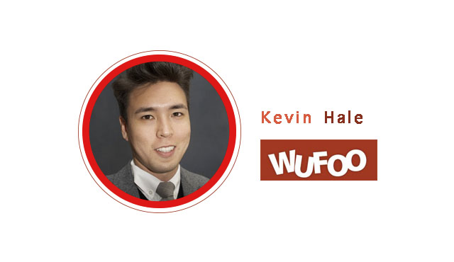
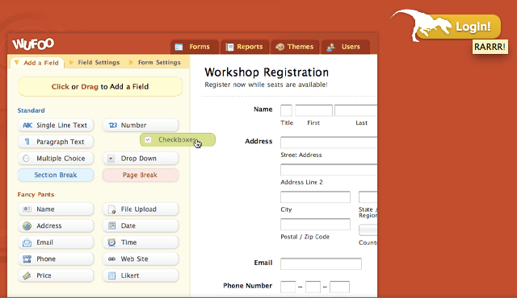
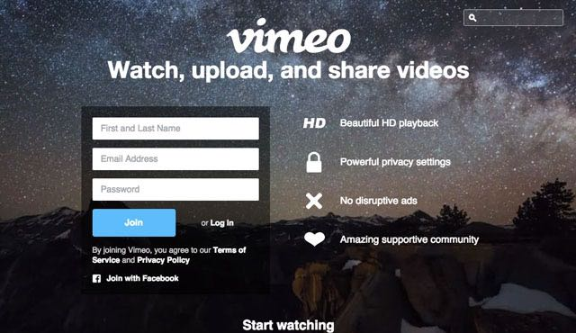
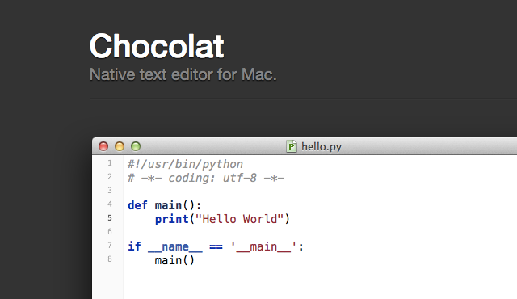
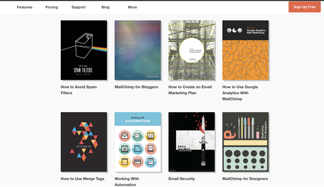
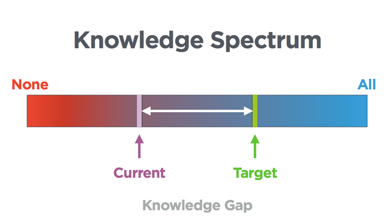
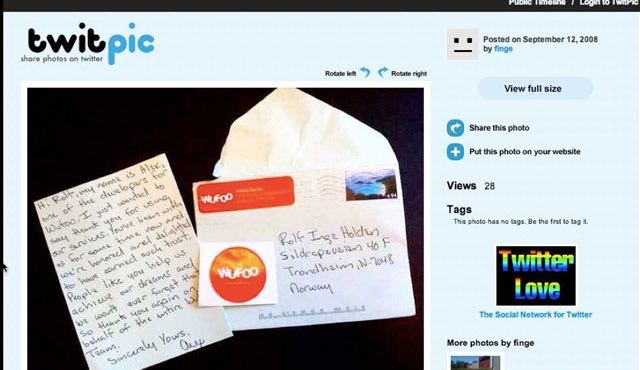

# YC创业第七课，与你的用户谈恋爱

YC与斯坦福联手开设的创业课程「怎样创立一家创业公司」第七课，由 YC 合伙人、Wufoo 创始人 Kevin Hale 抛开数据，从感性的角度聊聊，如何与自己的用户「谈恋爱」。

本文由 [How to Start a Startup Lecture 7](http://startupclass.samaltman.com/courses/lec07/) 听译整理而成。

上周大家听了很多关于增长的事，在我看来，产品用户的增长就是两个变量相互作用的结果：转化率和流失率。两者之间的一进一出，就能体现出产品是否能快速获得大量用户。通常我们习惯从数据分析问题，今天我希望能换个角度，讲得感性一点。

我是先创建了 Wufoo，再在此机缘上成为了 YC 的合伙人。Wufoo 做的是在线表单生成，例如你的网站需要收集用户反馈，可以通过 Wufoo 生成表单，嵌入到网站中，或者导出发送给用户，若有需求返回的数据 Wufoo 也可提供分析服务。因为使用方便，Wufoo 的用户遍布各个领域，不乏许多 500 强企业。我们在加州获得了 YC 的投资，但创始人其实都是在佛罗里达各自家里工作，连办公室都没有。2011 年，我们被 Survey Monkey 收购，当时公司只有 10 个人。平均来说，被收购或上市的创业公司估值能达到 2500 万，给投资者带来 676% 的收益率；Wufoo 虽然只获得 11.8 万投资，但回报率却高达 29，561%。

很多人问我 Wufoo 有什么特别之处，我常说「想要赚 1 亿，要先把心力投入到能让你赚到第一块钱的产品价值上」。我们希望用户不仅把我们的产品当做一个工具，更能爱上这个产品，与产品谈恋爱。所以团队内部常常自问，「一段感情在现实生活中是怎么建立起来的，这些经验我们可以应用到创造产品上吗？」

有了这个理念后，我们就像追求妹子一样追求新用户，像伺候老婆一样伺候老用户。

**先来谈谈怎么「追妹子」。**

我们回想一下在自己的感情中，经常拿出来回忆的小故事是什么？一定是初次见面，初次亲吻，求婚等场景。人类是很感性的动物，所以我们也想跟用户创造一些浪漫的、特殊的回忆，让他们能乐于与别人谈起。

其中第一印象非常重要。就像在现实生活中，我们会通过对方穿什么衣服，开什么车，用什么软件来下意识地给一个陌生人定性，用户也会通过获取的第一封邮件、登录界面、网站广告、交互体验等细节默默给产品定性。不像经历过时间考验的感情，陌生人之间的第一印象是很脆弱的。明明之前聊得好好的，突然有一天妹子就不乐意搭理了的情况并不罕见。所以不要再随便浪费跟用户互动的机会，想办法创造出让用户难忘的场景。下面给大家看几个例子。

这是 Wufoo 的登录页，右上角是我们的恐龙吉祥物，鼠标悬停在上面，原本应该出现的帮助文字被我们改成了「吼吼吼吼吼」。这个小改动通常能让用户会心一笑。

这是 Vimeo 的启动页，我觉得特别美，一看就觉得这个产品能带来不错的体验。还有一个产品人员脑洞大开的地方，就是如果你搜索「放屁」，鼠标滚动的时候真的会发出屁声。在公共场合使用时各位要当心了。Vimeo 的这个小设定，现在有多少人觉得自己之后会分享给朋友？

也不是都要在设计上做文章。比如 Cork’d 的注册页，名字输入框的注释上写着「你妈妈怎么叫你」，姓氏输入框的注释上是「你兄弟怎么叫你」，密码栏是「写点你记得住又不容易猜的东西」，密码确认栏是「就当作是测试，再输入一遍你的密码吧」。这些对话的语气都能使产品显得非常人性化，有特点。

这是一个叫 Chocolat 的代码编辑器，如果产品试用期结束，用户能享受到的功能不会有减少，但是所有代码的字体会变成 comic sans！各位能够感受到产品经理满满的恶意了吗？但于此同时，是不是也觉得很亲切，因为这个产品团队很了解自己面向的用户群。

这是 Mail Chimp，他们优化了自己的帮助手册，把它们做成一本本杂志的样子。然后这些手册的阅读率一夜之间就上升了，相对应的，客户服务的工作量大大减少。

Wufoo 开始开放 API 的时候，我们希望也能把这件事情做得带有我们自己的特色，而不是像其他公司那样，发起一个竞赛送几台 iPhone 了事。我们公司的几个创始人都是中世纪脑残粉，每到公司成立纪念日就带着团队去中世纪嘉年华。所以我们找到铁匠，给我们定制了一把中世纪风格的战斗斧，以此作为应用开发大赛的奖品。这个设置获得了很好的反响，想想看你要是告诉别人你为了获得一把武器而编程是不是很酷。最后我们收获了 25 个应用，这些应用的质量和数量原本都是我们在这个阶段不可能得到的。

**妹子追到手之后，我们再来看看要怎么好生伺候着。**

你们听过 John Gottman 吗? 他是一个婚姻研究者，只要给他看 15 分钟一对夫妇吵架的视频，他就能预测这对夫妇在 4 年内会不会离婚，准确率高达 85%。如果视频播放的时间能延长到 1 个小时，并且让男女双方分别谈谈自己对未来的期望和梦想，准确率可以提升到 94%。这个故事告诉我们，关系的走向从相处片段中就能看出。成功的婚姻并不是没有争吵，大家基本上都会为那么几件事吵架，钱拉，孩子拉，夫妻生活拉之类之类的。这些生活琐事在产品中则对应着要价、性能、竞争对手等等。从用户浏览网站，注册帐号试用产品，到成为活跃用户、付费用户，每一步之间若没有完善的用户支持，就会流失用户。可现在很多公司的状况是工程师与产品反馈是割裂的。有个词叫做「反馈驱动开发（SDD）」，即通过用户的反馈改进产品，每一个开发人员都是客服人员。Paul English 在这一点上做得很绝。他在工程师们的办公室里放了一台专用于接听用户反馈的红色电话。有人问他「你付给工程师们每年 12 万美金就让他们接接电话？」可实际上，这个方法对提高开发的效率非常见效。试想一个工程师如果三番两次接到关于某个问题的投诉电话，赶紧修改产品是不是最快速的解决方法？

让我们再回到 John Gottman 的研究上来。他发现当人们之间的关系出现如下四种现象的时候，最可能破裂。首先是指责，不是针对某一个具体事情指责，而是大而化之地说「你从来没有考虑过用户」或者「你根本就没有考虑过我们的未来」；再来是鄙视，某一方特意羞辱另一方；还有防卫，不愿负责任，为自己的行为找借口；最后是疏远，有意与对方保持距离。John Gottman 认为彼此疏远又是这四点中最糟糕的一个。再拿产品来说，用户的指责和鄙视是正常的，毋须害怕，可以解决；防卫心理更是无所不在，公司发展到一定的规模后在员工身上更容易看到；与用户疏远，接到用户的反馈却认为不重要，这样的心态才是直接导致流失率升高的罪魁祸首。

Wufoo 一直只有 10 个人做用户支持。当时在网站上注册的人数已经达到 50 万，再加上在其他网站使用 Wufoo 表格的人，总计能达到 500 万。每周我们有 400 个问题、800 封邮件要处理。公司规定下，工作时间的早 9 点到晚 9 点，对每个反馈的处理时间要低于 12 分钟，其他时间段低于 1 个小时，周末时则可以延长到 1 天。我们一直遵循这个规则，直至发展到今天的规模。

大家都知道，Airbnb 找了职业摄影师给用户的房间照相，以求达到更好的效果的故事。不过你们可能不知道，在创业初期，创始人 Joe 每天带着蓝牙耳机，不间断地做用户反馈处理。

在 Wufoo 我们也很乐于做关于用户支持的实验。有这么一种说法，因为在线上无法即时掌握到用户的表情，所以其实用户的需求和我们提供的帮助之间有一定的落差。为了在一定程度上了解用户的心态，我们在反馈栏里增加了一项，「你此刻的心情」。我们本不认为有人会填写这一栏，做好了失败的打算。但是万万没想到，这一栏的填写率高达 75.8%，接近「浏览器类型」的填写率 78.1%。另外我们还发现，单纯使用文字的反馈，用户只能通过感叹号，脏话，大小写来表达自己强烈的立场。因为添加了心情这一栏，我们获得的用户反馈更加友善，也更加理性了。

除此之外，Wufoo 的工程师每周和用户有 4 到 8 个小时的直接交流时间。与用户直接接触时间的长短和产品的优秀程度是成正比的。注意这里必须是「直接接触」，通过第三方的调查读几张表格是不算的。我们看下面这张图片：

假设线段的最左端意味着用户对如何使用产品一无所知，最右端意味着他们了解产品所有的特性。中间的两条线分别代表着用户现有的知识程度，和你希望他们掌握的知识程度。这两条线之间的差距，代表了产品的易上手程度。想要缩小差距，只能增加用户的了解或者降低产品的复杂度。团队很喜欢给自己的产品增加新特性，可实际上这意味着增大了用户使用产品的难度。

为此我们对用户帮助文档做了一次又一次的修改，力求在网站内部适时地给用户以准确的帮助，而不是一点「帮助」按钮，就带用户去庞大的帮助目录，让他们自行寻找问题的解答。做出改动之后，用户咨询数往下掉了 30%，你要知道，这也意味着整个团队的工作量少了 30%。

我在开头讲过，用户数增长是流失率和留存率共同作用的结果。大家都把眼光放在提升留存率上，忘记了降低 1% 的流失率和提升 1% 的留存率其实有同样的效果，而前者往往更加容易达成，也不需要耗费大量金钱。

现实生活中有一些人共同生活了 10 年，15 年，但是突然之间，没有征兆的，他们就离婚了。当人们好奇为什么会发生这种事情时，他们会说「我们之间已经没有激情了」。人类之间的感情是遵循热力学第二定律的，它会自然消散，必须不断注入新鲜的活力才能保持在原地。为了让用户知道我们在不断地完善，不断地有新功能出来，我们做了一个 Wufoo 提醒系统。它会告诉用户「你不再的时候，Wufoo 已经有了这些改变拉！」这会让用户觉得他的花费值回票价，因为付同样的钱，能享受到的产品性能却在不断提升。

Wufoo 初期的时候，我们在圣诞节附近有想过要以怎样的方式感谢用户。Chris 说，「小时候我妈非得让我在圣诞节的时候给亲戚们写感谢信，我不喜欢做这件事，可结果来年他们给我的礼物都棒呆了，不然我们也给用户写感谢信吧。」Wufoo 给用户手写感谢信的传统就是这么来的。

每封信都是团队人员手写，并且贴上我们的恐龙标志。

今天讲了很多感性的东西，希望大家能在商业数据之外，从另外一个角度考虑如何获得用户的喜爱。

**提问环节**

Q：如果你的产品面对的用户类型很多，你要怎么让他们所有人都喜欢你的产品？

A：产品的初期一定是先针对某一类人群优化的，就像 Pinterest 一开始针对的是做设计的博主。然后你要先保证自己功能上的完善再来增添那些能让用户「会心一笑」的小聪明，否则用户根本笑不出来。

Q：要怎么平衡好做产品和做市场做营销的比重？

A：我始终认为「口碑」是最好的营销。通过与用户的直接接触，我们的工程师对市场都有了一定的敏感度，当他们通过「反馈驱动开发」创造出了用户愿意传播的产品，那那些满意的用户就是你的营销人员。

Q：如果团队内部对产品发展方向有不同的见解要怎么处理？

A：首先我们收集到用户的反馈，再通过反馈分析出用户真正的需求进行产品的更新。另外一些不同的意见完全可以做出一个试验版本，实际测试看看是否可行。

Q：我知道 Wufoo 内部有「当一天国王」的规矩，可以告诉我们它是怎么运行的吗？

A：我本人不喜欢 Hackathons，因为通过 Hackathons 出来的项目，99% 不会落实到实际的产品上，这就很浪费时间和精力。我们做的是「当一天国王」，即从公司内部随机抽取一个人，让他根据自己对产品的不满，指挥全体公司人员依照他的想法对产品进行改动。当人们在做一项他认为很有意义，能给产品带来很大不同的项目时，往往是充满干劲的。我们会在周末进行这项活动，一年进行 1 到 2 次。

Q：团队远程工作通常听起来都非常可怕，你们是怎么做到的？

A：我们团队成员虽然都在家里办公，但是大家都住在同一片区域。我们规定每周五下午都是雷打不动的团队会议时间，然后每周有一天是用户支持时间，所以大家埋头做自己事情的时间每周也只有三天。在这三天的办公时间里，大家都极其自律，任何工作以外的事情都不会做超过 15 分钟。

远程协作有利有弊，有时反而需要花费团队额外的精力，所以并不是每一个团队都适合远程协作。

Q：作为一个管理人员，你是怎么做到让员工为自己的工作负责，不推卸责任？

A：我们有一个共享的 To-do list，每个人会把这周他会做什么写到列表上，下周的会议上大家会一起看看列表上的事项是否都已完成。