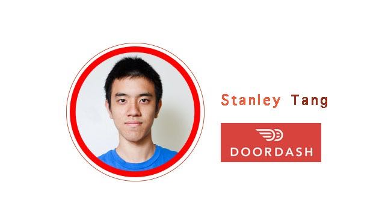

# YC 创业第八课：创业要学会吃力不讨好

YC与斯坦福联手开设的创业课程「怎样创立一家创业公司」第八课。本次 Sam 邀请到了两个 YC 孵化项目的创始人来谈谈企业的扩张问题。 Stanley 认为创业初期不应关注扩张，反而应该多做些吃力不讨好的事情。

本文由 [How to Start a Startup Lecture 8](http://startupclass.samaltman.com/courses/lec08/) 听译整理而成。

**创业要学会做「吃力不讨好」的事情**

大家好，我是 Doordash 的创始人，Stanley，前不久我还跟你们一样坐在学校的教室里面，手里拿着我的作业。但因为创建了 Doordash，我手里马上又多了一些东西：一张超速罚单，一张缴税单，还有一份从 Sequoia 获得的 1500 万美金投资。今天我要讲的就是这段对我来说很奇妙的旅程。

Doordash 做的是即时本地投递服务，可实际上我们一开始只是对如何创造对小店铺有帮助的科技产品感兴趣。一年放秋季的时候，我们采访了一家马卡龙店的老板娘 Chloe，想了解一下她的需求，让她对我们制作的产品原型提出点建议。就是在这一次采访中 Chloe 提出送货是她最大的难题。她有一大本本子，里面记录着店里的订单，其中有很多就是因为没有司机，没有时间送货而必须拒绝掉。在接下来的几个礼拜中，我们又先后采访了 200 家店铺，他们也都表示出自己对送货问题无能为力。可即便如此，我们对送货这个主意仍然不太有信心。因为这个需求实在是太基本了，之前难道没有公司对此做出过努力吗？如果已经有人尝试过了，那他们为什么会失败呢？我们决定就这个想法做一个简单的实验：在网上搜集 Palo Alto 地区一些餐馆的菜单，把他们整理到网页上，加上我们自己的电话，看是不是会有人下单。结果订单就这么来了。我们的第一单是个学者，出过一本书叫《Weed the People》，他那天订的是一家泰国餐厅。直到那一刻，我们才终于有了一丝现实感，这的确是一个可行的主意。

再接下来，订单数源源不断地增加。要知道我们网站的用户体验非常糟糕，你需要打开一个 pdf 文件才能看到菜单，才能看到我们的电话号码，可大家还是如此热情，这只能说明用户需求强烈到愿意忍受产品的缺点。

再回过头来想想，就是因为把这个产品当作是一次实验，所以我们没有纠结在什么华丽的算法、复杂的调度系统上，这个产品花了我们一个小时的时间就上线了。

在 YC 我们常说，要学会做一些吃力不讨好的事。Doordash 初期，下课后我们自己当司机送货，课堂上一有电话就出去接听当客服，在大学街道上分发传单当宣传。我们利用现有的产品拼凑出自己的一整套服务，Square 用于支付，Google Doc 来记录订单，Find My Friends 来追踪所有司机的动向。搞笑的是，就因为我们不断地有一些 15 刀，20 刀的订单进账，Square 一度怀疑我们是在洗钱把账户停掉了。

做这些「吃力不讨好」的事情其实还是非常「讨好」的，就因为我们参与了每个流程，所以对各个细节都有最直接的思考，不会纸上谈兵。我们借着自己送货的机会与餐厅和订餐人双方都有过交流，也靠着人工派遣司机的经验设计出了一套合适的派遣算法。

有一天我和朋友们正商量着去吃新开张的冰淇淋店，在路上突然一通电话说有一大波订单正在靠近。我们纠结了一下最后还是跑去送餐了。直到那一天我们才开始考虑，或许是时候不再完全依靠人工解决问题，拓展公司的规模了。

Q：第一个客人是怎么知道你们的？

A：其实这个问题我们自己到现在也都不知道，有可能他正好在搜索引擎里打入了 Palo Alto Delivery，然后就搜索到我们了。

Q：现在回过头来看，你们觉得自己和其他同类公司有什么不同？

A：可能是移动化。我们没有长期雇佣的司机，也没有买运输工具，所有的订单信息都是通过手机即时传达给有空的人。

Q：你们从什么时候开始扩张公司规模，把它当作一项事业来发展？

A：我们在 13 年 1 月创建，那年夏天就决定加入 YC。

Q：除了送餐外，你们对公司的未来还有什么打算？

A：我们还是报有原来的想法，希望能做更多符合小店铺需求的科技产品。

**如何做公关**

大家好我是 Kiko 和 Twitch 的创始人，Justin Kan，今天我要根据我之前几次创业的经验来谈谈如何做公关。

首先做公关不要盲目，要带着一定的目的。Socialcam 是一款类似于视频版 Instagram 的应用，当我们打算拉投资的时候，就会找一些科技媒体的曝光，让投资人知道我们是非常火热的社交应用；Exec 是一款针对本地清洁服务的应用，当我们想增加在目标用户中的知名度，就会寻找一些本地人会阅读的媒体；Twitch 做的是游戏直播，我们想覆盖到游戏行业的所有人员，就针对一些游戏开发博客和行业动态网站投放了广告。

在你寻找到媒体前，你要先预备好公司的「故事」。比如你们融到了多少钱，一周营收一百万刀，或曾把美金冻在冰块里面倒在 Paypal 总部门口（WePay 抗议 Paypal 冻结开发者的帐号），招聘到了什么重量级的人物等等等等这些能吸引到读者眼球的内容。然后以局外人，而非创始者的角度，纵观整个故事，看它是不是真的很有趣。如果我是读者，我会通篇阅读吗？让故事变得更加有阅读性的一个技巧就是找到一个独特的角度，不要做「Kickstarter 上第二个融到 500 万刀的人」，要做「第一个在 Kickstarter 上融到 1000 万的游戏主机」。

有了故事之后就需要联系媒体人了。不要发邮箱联系，最好的办法是找到之前也在这家媒体曝光过的创业公司，让他们把你介绍给采访过他们的记者。如果你作为记者，是不是会觉得一个自己原本采访过的有趣对象推荐的公司，可挖掘性会比某个邮箱中不知名公司要高？

与媒体的约期要尽量提前，不可能你明天要发布产品了，他们还能专门在今天的杂志上为你写篇文章。

同样，与媒体的约谈最好能做到面对面交流。一个记者在你身上花下的时间成本越大，他对你的重视程度也会越高。

在谈话时，不要被对方牵着鼻子走。自己在心里先拟好提纲，有什么重要的事情是需要讲的，按照自己的节奏讲出来，控制住场面，让记者跟着你的思路走。

最后要做的就是在文章发布的前几天再次发邮件确认细节。比如产品名字，创始人名字的拼写，一些想要强调的信息等等。

有些人问我，找公关公司来做这些事情可以吗？答案是不可以。公关公司通常只会给你一个名单，上面列着所有相关媒体的联系方式。他们会帮你联系媒体，处理一些琐事，但他们不懂产品的核心，没法写出你想告诉受众的那些公司的「故事」，继而就无法打动读者。再者，公关公司要价不菲，一个月需要 5 千到 2 万刀不等。这笔钱对创业公司来说通常都是无法负担的，并且价值不大。

采访结束后要与工作人员继续保持良好的联系，因为随着产品的发展，你很可能还需要第二次，第三次曝光。这个曝光的频率要掌握好，如果产品没有什么新鲜事却天天出现在读者眼前是会引起厌烦的。另外，一旦产品出现负面的报道，熟识的媒体朋友还能为你们提供正名的发声渠道。

最后我想说，在媒体上曝光看起来非常光鲜，不要因此而得意忘形，觉得自己已经成功了。一个产品真正的成功看的不是团队的公关手段高明与否，而是用户数、用户使用频率，以及大家的喜爱程度。