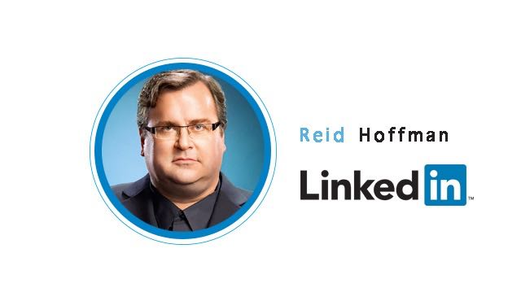

# YC 创业第13课：创业者的条件

YC 与斯坦福联手开设的创业课程「怎样创立一家创业公司」第13课。LinkedIn 联合创始人 Reid Hoffman表示，身为创业者，工作中要学会平衡各种看似矛盾的特性，是坚持想法还是灵活变动？是勇于冒险还是谨慎行事？平衡各个元素是成为合格创业者的首要条件。

本文由 [How to Start a Startup Lecture 13](http://startupclass.samaltman.com/courses/lec13/) 听译整理而成。

在大家有了创业的想法后，可能会考虑，怎样的人才适合去创业？创业需要具备什么特定的技能吗？

在大众印象中，优秀创业者的形象总是与 Steve Jobs，Bill Gates，Elon Musk 等人连系在一起。他们似乎是全能的超人，市场、产品、管理、融资，什么都能做。可实际上，没有人是全能的，你只可能在特定的某些方面有过人的长处。而创业过程中可能遭遇问题所涵盖的领域又非常广，所以找到一个能补足自己能力、互相信任的合伙人很重要。两三个人互相协作，总是好过一个人孤军奋战。

优秀的创业者要懂得分辨哪个城市适合自己的公司发展。举个例子，硅谷虽然聚集了世界各地的软件人才，但却并不适合 Groupon（高朋）发展，因为 Goupon 前期发展需要强劲的销售团队，硅谷无法提供合适的人才和相关产业链支持。我经常把创业比喻成一个人跳下悬崖，然后想尽办法在半空中组装出一架飞机自救，意思就是不要放过每一个能增加你生还机率的机会。不要认为互联网公司就理所应当在硅谷起家，你要同时考虑到市场、产业链的问题。

创业者要很清楚自己能解决一些其他人无力解决的问题。现在流行一句话叫做「好的主意在一开始是不被看好的」。我认为这句话更加准确的说法应该是，「一个主意在他人眼中难以实现但创业者却自有一套可行的解决方法。」从这个角度理解，「不被看好」的确是创业者应该具备的品质。这种「不被看好」可以是其他人认为市场很小，可实际上面向的人群非常大；或者是找到相关人才非常困难，可你恰好具备这样的人脉等等。

在创业的过程中，创业者还会面临是亲自完成一项工作，还是交给他人完成的抉择。答案是，视情况而定。有时你需要亲力亲为，有时则可托付他人完成，有的时候，两种情况会同时进行。

同样需要创业者调整的一对矛盾体还有「灵活」与「坚持」。你的左耳会有声音说，「对未来的发展道路要有规划！坚持自己的立场！」，「不被看好不重要！坚持走自己的路！」同时右耳也有个声音在说「用数据说话！」、「听取用户的建议！」、「要调整产品定位！要灵活！」判断什么时候要灵活，什么时候要坚持，就是考验一个创业者的时刻。每当这种时候，创业者可以模拟撰写一份商业计划书，再次梳理思路，「为什么这会是一个好产品？」，「其他人不看好的点我是否能够解决？」如果你对这些问题都有自信的回答，那就坚持自己的想法；如果没有，马上着手寻找解决方案。

有的创业者还会有疑虑，是把工作重心放在公司内部事务上专心打造产品，还是放在建立人脉，招聘员工，拓展渠道等外部事务上？答案同样是这两者都很重要，创业者需要根据当下面临的情境，很灵活地调整这两者的比重。

有一类创业者是完全数据驱动的，他们有一套强大的创业理论，搜集数据，分析数据跟着数据走。可实际上，数据应该是为理念服务的。数据只能用来评估现行方法能不能实现目标，它不应该用来指导理念。例如当我在 Paypal 团队时，我们的理念就是通过电子化让交易更加便捷。这个理念没有改变，但形式却几经更改，从银行模式，到借记模式再到最终今天的样子。理念实现形式的改变，才是由数据做主导。

大部分选择创业的人都是乐于接受挑战的性格，但是要搞清楚，创业人员面临的最大的风险应该只是上文所说，被其他人「不看好」的那一点。在其他方面，创业人员同样要谨慎行事，把失败的风险降到最低。就像这张图片上的老鼠，敢于动奶酪，也要记得戴安全帽。

最后一点，创业人员既要妥善处理眼前的事务，例如「今天有哪些必做事项」，「这周项目是否有进展」，也要时刻记住对未来的设想，问问自己，所做的这一切，是否都在为实现那个最终的目标而努力。

所以，一个优秀的创业者可能对软件很了解能打造出完美的产品，也可能具有能带来人际网络的领导力，或者永远思路清晰能认清团队是否走在正确的方向上。各行各业，各个年龄段，各种背景都有可能孕育出优秀的创业者。不要被固有的创业成功者的形象遏制了想象。同时，创业犹如在迷雾中行走，看不清前进的方向是常态，创业者需要依靠自己的学习和适应能力，善于利用已有的优势和资源，创造出自己的天地。

Q：你在多大程度上会根据他人的推荐评价一个创业者？

A：我很看中他人的推荐，实际上我只跟通过引荐的创业团队见面，这也属于筛选的一部分。为什么 Airbnb 团队才陈述两分钟我就决定投资他们？因为早有人跟我引荐过他们，在他们进来前我已经对他们非常了解。

Q：你觉得对问题有洞察力是一个好创业者的标志吗？

A：当然。好的创业者准确地知道自己在做什么，不会泛泛而谈假大空。如果连自己想做什么都无法清晰地表述出来，那肯定也无法聚集周围可利用的资源，无法吸引到投资，也无法招聘到人才。

Q：LinkedIn 有一段比较艰难的时期，在这种时刻你们是怎么坚持下去的？

A：我们觉得无论对于个人还是企业，拥有一个职业化的公开简历是有益的，这个产品符合我们的世界观，所以我们能一直坚持下去。当时互联网更热衷于熟人之间的社交，LinkedIn 虽然没有获得爆发式的增长，但也能做到逐步稳健上升。

Q：有没有发生过误判的时候？

A：有些人会伪装自己具有某些品质，就像我在面试人的时候也会伪装，心里已有定论，但不表现出来，而是做出一副探讨的样子。面试者也会如此，嘴巴上讲的和心里想的并不一致。这种情况其实很难去避免。

Q：要如何评价一个合伙人？

A：最重要的一点就是合伙人能合作无间，技能互补。通常团队需要一个技术人员，一个处理融资、推广等商业事务的人员，大家凑在一起能组成创业所涉及的各个领域。另外从团队成员之间讨论问题的过程可以看出来，好的团队是能通过脑力激荡找出问题的最优解，不是一味地赞同，也不是只固执于自己的想法。

Q：应该在什么时机对产品进行改动？

A：如果你对产品的信心在很长时间内都在下降，较好的对策已经实践过，情况依然没有改善，那就该停下来想想是不是前进的方向出错了。要注意，不要等到自己真的无路可退了才开始改变，那时已经太晚了。