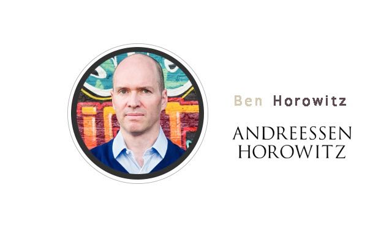

# YC 创业第15课：换位思考

YC 与斯坦福联手开设的创业课程「怎样创立一家创业公司」第 15 课。本期主讲人为 Ben Horowitz，硅谷顶级风投公司 Andreessen Horowitz 创始人，参与投资 Groupon、Instagram、Skype、Oculus 等科技公司。他截取了自己创业书籍，《The Hard Thing About Hard Things》中一个最重要的概念告诫大家：身为创始人，要懂得换位思考。

本文由 [How to Start a Startup Lecture 15](http://startupclass.samaltman.com/courses/lec15/) 听译整理而成。

关于如何管理一家公司，我写了本 300 页的书，今天我们只能讲讲其中一个概念，这个概念很难落实  ，无论是在起步阶段，还是步入稳定后的企业阶段。这个概念就是：要懂得换位思考。当你做出一个决策之后，要考虑到其他人是怎么看待这个决策的。不止是从自己的角度，从与会者的角度，还要考虑到不在现场的每一个职员对这个决策可能产生的解读。之所以要这么做，是因为没有人能拥有相同的对话语境。作为一个创业者，你曾经接触过的创业知识、用户数据、战略考量，他人很有可能一无所知。例如当你辞退某人，务必告诉其他员工你辞退这个人的理由，否则大家会陷入无尽的猜测，惶惶不可终日，不知道下一个被辞退的会是谁。不做好这一点，你所做的决策很可能会产生一些莫名其妙的副作用，甚至埋下危险的种子。这很难做到，因为创始人时间压力、工作压力、精神压力都非常大，一不小心就会疏忽。

我会为大家模拟几个场景，有些是以我实际经历过的事情为蓝本，我们一起来练习、感受一下，在这些场景里，CEO 要怎么落实我刚才所说的注意事项。

**场景一：降职还是辞退？**

现在你公司的管理层有这么一个人，他是个聪明人，并且比公司里任何人都勤勉工作。但很可惜，他不具备公司所需领域的技能和知识储备。作为 CEO，你会辞退这个人，还是会将他调离到一个更低层级的职位？

从你的角度来说，要辞退一个兢兢业业的员工似乎不太合情理。选择调职既留住了人才，也符合其他员工的心理期待。从这个管理人员的角度来说，被辞退对他再次求职会有较大的影响，降级则可以伪装成一次职务变动，不像被辞退般尴尬。这是一个真实的例子，听到这种情况后我问创始人「这个管理人员拥有公司多少股份？」答案是他拥有 0.5% 的股份，同时，该公司的工程师只拥有 0.1% 到 0.2% 的股份。试想，一个不再担当重要职务的人员坐拥公司 0.5% 的股份，高过每天辛勤工作的工程师，技术人员们会觉得这公平吗？如果撤回股份或者降低薪资，该管理人员还能保持原本的心态付出吗？

所以，看似只是对一个人「辞退」还是「降职」的选择，实际上却向外界传达了很多信息。你在告诉大家「无力完成本职工作会被如何处置」，「怎样才能保留住自己的股权」，还有「公司是结果导向的」。最终选择怎么做，还要再受其他细节的影响（例如该人是从外部招聘而来还是从内部提升而来），但我们讲这个的重点就是，要看到这个事件在不同人眼里的样子。

**场景二：优秀员工申请加薪**

这个员工是真的很优秀，从你的角度来说，你肯定想留住这个人才，他的能力出众，给予他与他能力相称的薪资无可厚非。从这个优秀员工的角度来说，他向老板申请加薪，肯定不是脑门子一热胡乱做出的决定。说不定他正在被其他公司挖墙脚，他在对比各种条件，或者其实是他的爱人希望他能做这件事等等家庭因素。所以加薪的申请能被通过，肯定解决了他某个困扰。一个人被加薪，不要觉得你们在办公室里说过这件事情保密，它就真的会变成一个秘密。马上所有人都会知道，这个人薪水涨了。其他没有要求加薪的人会怎么想呢？首先，有的人会觉得自己比那个得到加薪的员工更加优秀，他们会想「我觉得自己只是做了份内的工作所以并没有要求加薪，他脸皮比较厚去问了，但老板怎么就同意了？老板到底有没有好好地评估个人成绩，太不公平了。」然后大家都会一直揣测，「不主动提就得不到加薪，那我也要找个适当的时间去申请一下。」大部分 CEO 应该都有这个经历，如果你给一个人加薪了，那接二连三会激励更多的人要求加薪。

这个问题是有标准正确答案的。加薪的过程必须流程化。我知道这在很多创业者耳朵里听起来并不受用，因为他们排斥大公司的制度化，喜欢灵活，喜欢顺其自然。可加薪是个非常敏感的话题，将加薪的过程制度化、流程化是对公司文化的保护。你可以每个月，或者每个季度对所有员工的业绩进行一次评价，再决定出谁可以获得加薪。任何在评价流程自行找上门来要求加薪的请求都不予考虑。这实际上对员工来讲也是一件好事。因为他们不用每天担心自己的努力没被看到，不用担心自己的付出没有回报，把精力专注在工作上。

**接下来好玩的来了，我们来分析一下** **Sam** **的一篇博客文章。**

他为难我把一本 300 页的书浓缩成一节 50 分钟的课，我必须加入这个环节报复一下。Sam 的文章里是这么说的：

员工在离职后通常只有 90 天的时间来行使他们手中的期权。可行权价格加上税金通常是一笔不小的钱，如果员工不能在 90 天内支付这个数字，那就将失去以较低价格购买公司股份的权利。有人明明已经不适合在公司工作下去，却会因为不想失去这份利益而被束缚住。有的人是被公司辞退，那他失去工作的同时又失去了原本可以获得的收益，更是一个沉重的打击。我认为行权的有效期应该延长至 10 年。

大家觉得 Sam 说得对吗？

行权有效期 90 天这个规定已经盛行了将近 30 年，公司普遍采取这个数字是有原因的。美国会计原则委员会的第 25 号意见书曾规定，如果你给员工的行权期限是 10 年，那公司就不能进行上市或者被收购。因为这样会使得公司的支出与股票价格挂钩，财务变得永远无法预测。

碰到这种事情，创始人当然也不想辛勤工作的员工到头来一无所获，也不想强行把不适合的人才留在公司中，但是又会希望留在公司的员工能获得更多的期权。这个即将离开公司的员工，如果因为经济问题而被迫放弃原本应得的利益，一定会怨声载道，这对公司的名誉会有一定的影响。至于其他员工，他们很容易就会把自己带入离职同事的位置思考，「离职是个明智的决定吗？如果我也离职，是不是能够获得更大的利益？」

这个问题没有一个明确的答案，我只能告诉大家在做出决策前需要考虑到什么。

1.  硅谷的公司每年平均有 10% 的人才流动。  
2.  企业股份每年会因发放期权被稀释 6%-8%。  
3.  如果离职员工无法行使自己的期权，这部分过期的期权就可以重新回到期权池中，分配给在职员工。  
4.  若将期权行使期限延长到 10 年，那离职后加入新公司的人手里既有原来公司的期权，又有现公司的工资和期权，他的收益是不是比那些留下来的员工还要高？  
5.  员工若因害怕失去收益才不愿离开，那他对公司来说是不是「不正确的人」。  

这是创业中一个复杂的问题，我觉得每个企业都需要重新权衡一下他们所在乎的利弊，再做出自己的决定。

**最后我想讲一个历史上最懂得从各个角度考虑问题的人的故事：****Toussaint Louverture****。**

Toussaint Louverture 是奴隶之子，当时海地的奴隶制度比美国要残酷许多，他却拥有废除奴隶制，夺回国家主权，并把它建立成世界上一流国家的雄心。当他打败了当地的奴隶主，打败了先后侵略而来的西班牙、法国军队，他的前两个愿望已经完成了。

士兵们在战争过后总是喜欢通过大肆掠夺来狂欢，Toussaint 严令禁止了一系列野蛮的行为，甚至连对妻子有不忠的行为都要遭受处罚。他军队的风纪另白人首领都刮目相看。他从与欧洲军队的接触中感受到欧洲文明的发达程度，于是他大胆启用敌方的将领人才，借他们的经验和技术，提升海地的文明程度。能如此冷静地抛开自己原本的立场，从长远的目标考量衡量利弊，实在是非常伟大。尤其是考虑到他严酷的成长环境。

随后他面临的第二个问题：要怎么处置原本的农场主？

对原本身为奴隶受农场主欺凌的士兵们来说，杀掉农场主，收走农田，让他们从此过上自由的生活是最大的诉求。对农场主来说，经营一个奴隶制的农场对他们来说更像是一笔生意，他们买地，买人力，都是这个商业过程的其中一环。对 Toussaint 来说，他的目标是建立一个世界一流的国家，其中经济建设是最基础的，而经济建设的重要支柱就是农场产业。若取缔原本的农场主，那他将失去原本的产业链，关系网，也失去了运作产业的人才。所以他并没有剥夺去农场主的土地。不但如此，他要求农场主花钱雇佣工人，政府还降低相关税收以扶持产业。

Toussaint 领导的海地革命是世界上唯一一次获得成功的奴隶革命。他们打败了拿破仑，经济蒸蒸日上，果然成为了世界一流的国家，年出口值甚至高过美国。

回到我们的话题上来，从他人的角度去看问题是个需要学习的过程，创业者要训练自己从自己的员工、合作伙伴、投资人等等所有相关人群的角度来考虑一件事情的利弊。

Q：要怎么告诉管理层人员，他被辞退了？事后跟其他员工要怎么解释这个事情？

A：告诉被辞退的人你辞退他的真正原因，同时你要意识到，之所以造成今天的局面，当初招聘失误要负很大的责任。你可以拿走一个人的职位，但是不要拿走他的尊严，在其他同事面前同样要感谢他的付出，对于具体原因则不需要过度解释。

Q：要怎么缓解做一个 CEO 的压力？

A：无论发生什么，不要乱了阵脚，把关注点放在自己能做的事情上，分析当下的处境自己有哪些选择。

Q：Toussaint 怎么做到让敌军将领忠于他的军队？

A：因为 Toussaint 的行为出乎他们的意料。他们以为与自己战斗的只是一支不经开化的野蛮军队，他们以为战败后自己只能面对一死，可 Toussaint 却欣赏他们的能力，重用他们。这让他们打破自己原本的观念，重新评价这个人。

Q：有没有什么技巧能让我们更好地从他人的角度考虑问题？

A：不要急着做决定。一个优秀的员工来问你他可不可以加薪，这个时候你肯定能感觉到这是一个比较重大的问题，你事先对这件事并没有考虑，那就不要急着回答他。告诉他这件事情很看重，你需要一点时间来考虑。