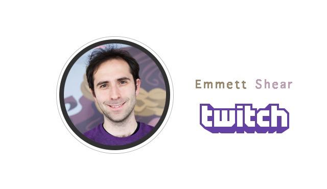

# YC 创业第16课：如何做用户调研

YC 与斯坦福联手开设的创业课程「怎样创立一家创业公司」第 16 课。本期主讲人为 Emmett Shear，视频直播游戏平台 Twitch 创始人，2014 年8月份被亚马逊以 10 亿美元高价收购。本节课他将现场演练用户访谈，并表示访谈对手公司用户，往往能获得最具价值的反馈。

本文由 [How to Start a Startup Lecture 16](http://startupclass.samaltman.com/courses/lec16/) 听译整理而成。

大学刚毕业的时候，我和我的朋友 Justin Kan 一起开发了一款日历应用。我们自己平常不使用日历，也没有做用户调研，最后这个产品以放在 Ebay 上出售收场。第二个产品，我们还是没有做用户调研，全凭自己的需求打造了一款产品。这就是 Twitch 的前身，Justion.tv，一个用于直播 Justin Kan 真人秀的产品。虽然有点玩票性质，但我们没想到，居然还有人对在网上直播自己的生活感兴趣，所以产品获取了小范围的关注。我们的产品对直播有非常完善的支持，但是我们不知道除了这个，我们还能做些什么。为了让这套直播系统发挥出更大的作用，我们决定在内部尝试转型（pivot）为游戏直播。这一次我们进行了大面积的用户调研。通过调研收集到的数据，在很大程度上决定了我们接下来三年的产品走向。调研在创业过程中一直不断地进行着，公司甚至设立了一个部门，专职与用户交流。

在思考如何进行用户访谈，如何根据用户提供信息完善产品之前，我们要先确定找什么人访谈。Twitch 的主要用户被定位为发布视频的人，而不是观看视频的人，因为拥有高质量的视频内容才是产品的核心价值。

现在假设我们要开发一款笔记软件，用于课堂上摘录知识点，大家觉得我们需要针对哪些人群做用户访谈？

（思考120秒）

学生：当然是大学学生，因为他们是课堂笔记软件的主要使用人群。这些学生的专业分布要尽可能地广，因为一个英语专业的学生和一个计算机专业的学生，对笔记软件的需求不会相同，摘录的习惯也不会相同。

Emmett：总体来说很正确。但有一点没有考虑到的是，学生群体是最不可能为一个教育类应用付钱的群体，在座有很多估计连教科书都不愿意买吧。为这些学习辅助用具买单的，通常是学校的教务部门、IT 部门。像这样虽然不是直接使用用户，但是却与产品成败息息相关的周边人物还有新生的家长，为了孩子的学业他们很容易被说服。

下面我想邀请一个同学上来，扮演被访问者，演示一次真实的用户访问过程。

Emmett：你好，感谢接受这次用户访谈，可以先谈谈你在课堂摘录笔记的习惯吗？

Stephanie：  为了追求速度和效率，还有方便日后查询，我会用笔记本做课堂笔记，大部分是以文字的形式。但是在上物理课的时候，因为有很多图表，所以还是用纸笔记录更加便捷。

Emmett：这些笔记你在课程结束后还会再去复习吗？

Stephanie：纸笔记录部分基本上不会再回去看。但用软件记录的部分会，因为电子版的很方便获取，而且可以和同学互相分享、整合笔记。

Emmett：电脑端你具体会使用哪些软件？

Stephanie：Google Docs, Evernote。

Emmett：为什么这两个类似的软件同时都在使用？

Stephanie：我更倾向于用 Evernote 做个人的摘录，虽然它也有分享功能，但是要和朋友之间共享文件的时候我还是倾向于选择 Google Docs。有小组项目的时候，我们通常会在 Google Docs 上新建一个文件夹，大家把文档都放到里面。

Emmett：所以在学期末的时候你是看自己的笔记比较多还是借鉴人家的笔记比较多？

Stephanie：我基本上只看自己的笔记。因为我对笔记的格式呀，做重点的方式阿都会比较挑剔。所以即便是借鉴了人家的笔记，我也会用自己的方式再梳理一遍。

Emmett：Evernote 上的笔记，Google Docs 上的笔记，纸笔记录的笔记，哪一个你会更倾向于去回顾？

Stephanie：关于课堂知识的笔记我较少回顾，但一些课程外的内容，例如今天的讲座，还有我正在准备的采访计划等等个人总结出来的东西，我经常会回顾。因为这些内容我希望自己能清晰地储备在脑中，算是应对未来事务的一个准备。

Emmett：这听起来很有意思，你在课堂之外也会摘笔记吗？

Stephanie：是的，当我去听一次演讲，参加一次集会，  或者只是和某个人聊天后，我会总结出要点记录下来。

Emmett：好的谢谢你。

通常来说我还会问更多细节的问题，例如  「你需要和哪些人一起协同工作？」，「笔记的通常有多长？」等等。今天在课堂上就不再展开。这个对话里有几个重点我希望大家能注意到：

1）我们没有谈论任何关于 APP 细节的内容。我不是很关心 Google Docs，Evernote 到底有什么功能，因为一谈到这些细节就很容易偏离主题，用户会觉得我很清楚自己需要哪些功能，就像一辆马车，用户会说我需要一匹更加健壮的马，他不会真的去考虑解决「交通运输」这个更大的问题。

2）可以从用户访谈中了解到用户是否真的对你的产品有需求。从刚才的对话来看，我觉得没有开发一个新产品的必要，因为我没有看到这整个流程里有什么致命的、急需改进的问题。这当然不是说你要根据一次谈话就放弃掉整个项目，再去找更多的人交谈，  为这个问题感到困扰的人，说不定就在前方。同一类型的用户，调研6，7个人之后基本上就不会再有新的信息。所以覆盖到各个可能的用户面，或者用户的相关人群很重要。

下一个环节，就在 Stephanie 的回答的基础上，大家想想，如果我们要在 Google Docs 上再加上一个功能，一个能让 Stephanie 惊喜，从此就放弃使用 Google Docs 转而使用你的产品的功能，你会添加一个怎样的功能？

学生：Stephanie 使用 Evernote 的原因是 Evernote 更像是一款可以随手记笔记的软件，Google Docs 更像是正式的文件。所以我觉得推出一个比较轻便的移动端 APP 能符合她的需求。

这个主意不错，有了这个想法之后我们接下来要评估一下，这个功能是不是真的好到用户愿意放弃原来的产品？有两种评估方式，第一，马上开发出一个最小可行的产品，投入到市场中，看用户给出什么反馈。虽说是最小可行，但要达到可行还是会花去3个月时间。还有另一种方法就是把自己的想法在纸上用图表、用模型再现出来，再拿这个模型去询问他人的看法。另外让用户为产品买单也是检测产品优秀程度的试金石，如果用户不愿意花出那5美金，说明这个产品在他们心里还没有那么好。

最后我想给大家看看 Twitch 从用户处获得的反馈。

这是产品深度用户给出的反馈：

「标题无法高亮」

「希望可以自主选择评论的呈现方式（比如以弹幕形式）」

「希望聊天室能有清除屏蔽词汇的功能」

我们能发现这些建议都非常具体，但他们不是 Twitch 的当务之急。事实证明用户是可以忍受这些缺点的。

接下来是使用其他直播平台的用户给出的反馈：

「用户体验在欧洲非常糟糕」

「如果其他人也可以在我的频道发布直播，我会考虑使用 Twitch」

「我希望能通过这个赚到钱」

「不够稳定」

这些缺点比网站现有用户提出来的缺点要严重很多，因为这是实实在在的，不愿意使用我们产品的原因。这些用户非常成熟，他们对直播领域的产品也非常了解，要找到这些用户给我们做出反馈很不容易。

最后是一些来自非直播用户的反馈：

「我网速太慢，无法做直播」

「不想让我们的战术在直播时泄露」

「我想做更加精致的教学视频，而不是简单地直播」

这些用户对游戏直播行业来说是占大多数的，他们没有使用过任何直播产品。争取到对手网站的用户不过是抢占更多的市场份额，了解非直播用户的心里却能帮大家把市场一起做大。

不要在意用户提出的具体产品功能，抓住他们真正想要的。用户要的是能挣钱，要的是稳定和高质量，要的是全世界都能看到他们的直播。这些需求才是我们真正的关注点。

实际上我们的第一批用户，有许多就是来自于用户调研群体，他们看到自己的需求真的被落实到产品功能，感到非常惊喜。

分析数据也可以算是了解用户需求的一个途径，但数据往往与用户想要的想去甚远，辛辛苦苦打造出来的功能不被喜爱对团队来说是一件很失落的事情。

Q：做用户调研时最常见的错误是什么？

A：不要给他们看你的产品，不然就像我之前说的，他们会陷入到讨论具体功能的怪圈中去；只找对的人做调研，寻找某人做调研的原因不应该是他的调研容易获取。我们团队曾花了一周的时间调查到我们想要调研人群的联系方式。

Q：如何让团队其他成员也支持你所做出的决定？

A：尽量录下与用户之间的访谈，这有两个好处，首先你不会因为做笔记而分心，其次就是你可以把录音放给团队其他成员听，录音很有说服力，播放之后团队成员就会理解你的选择。

Q：针对海外的用户要怎么做调研？

A：Twitch 支持得最好的还是英文用户的使用习惯。其他用户我们只能通过翻译交流。所有产品都这样，对本地用户的支持总是最好的。

Q：你是怎么找到愿意参与调研的用户的？是否会支付他们酬金？

A：我们通常在其他网站上找到这些目标用户，会利用该网站自带的发信功能；也会通过一些赛事找到一些目标用户。

我们至今没有给过任何人酬金，我想大家都是对这个问题有一定程度的热情，就算没有酬金也愿意跟一群解决这个问题的人聊天。

Q：产品本身的反馈机制不管用吗？

A：有一定作用，但知道用户在一个页面逗留多久，在观看视频的哪个节点退出，这些信息就像我之前说的通过图表分析一样，太死板了，最后出来的结果和用户的真实需求总是不尽相同。