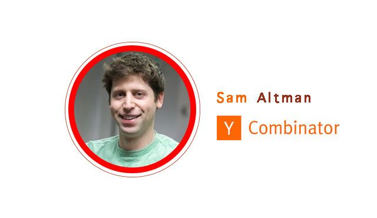

# YC 创业第20课：不再打磨产品

本节为 YC 与斯坦福联手开设的创业课程「怎样创立一家创业公司」第 20 课，也是本系列的最后一课，由 Sam 为整个课程划下句号。本次讲课，他提及到例如企业的管理，人力资源等，初创时可以忽略，但公司发展到一定程度后逐渐重要的内容。

本文由 [How to Start a Startup Lecture 20](http://startupclass.samaltman.com/courses/lec20/) 听译整理而成。

欢迎大家来到我们系列课程的最后一节。今天讲的东西跟之前有所不同，它不是开发产品，也不是与用户交谈，它在企业创立初期理所应当被忽视，但一年后、两年后，当公司人数扩张到 25 人以上，逐渐步入轨道时，这些问题会逐渐浮上台面，大家要即时做好准备。

**首先我们要谈的，是企业管理**

在公司人数达到 20-25 人之前，是没有必要进行所谓的企业管理的。公司的结构很简单，就是所有人都向创始人汇报工作。在创业初期，为了达到高效率，这么做完全没有问题。但是随着人数的上升，缺乏组织结构的劣势会突然被放大。你要随时注意这个临界点的到来，即时引入一个简单而有效的管理方式，即给每个员工指定一个上级汇报工作，每个管理人员也清楚知道自己负责哪些人的工作。简单、明了是这个管理方式的重点。

不要觉得「无组织管理」听起来很酷，就心血来潮地要革新企业管理理论；也不要把这件事情想得太复杂。把时间和心思多花在产品的创新上，企业管理方式简简单单就好。

这个时期其实是创始人工作目标开始改变。在公司产品推出市场之前，「打造一款优秀的产品」是唯一目标；公司上轨道之后，这个目标要变成「建立一个优秀的公司」，这个目标会跟着你一直走下去。这可能是创始人在创业过程中要经历的最大的一次心态转换。许多人会在这场转换中犯错。常见的例子有：

（一）不敢聘用高级管理人员。公司的管理模式在逐渐成型，这时一个有着丰富的经营公司经验的管理人员是非常有价值的。

（二）逞强开启英雄模式。公司在不断成长，所以需要不断补充新人员分担工作量。根据公司的成长速度预估好招人时间，不要一味往自己和原有团队成员的肩膀上增加负担。

（三）不懂分派任务的正确方法。「帮我研究下这方面的内容，汇总出数据和各个实施方案的利弊，我来判断采取哪一种方案，你再去执行」，没有管理经验的新人很可能会对下属说出上面这样的话。这会让下属觉得很不受尊重。正确的做法应该是，「这件事情在处理上我觉得有几个要注意的点，我是这样这样觉得的，不过具体怎么做，你去研究一下，完全由你做决定。让我知道你的最后决定就好了。你办事我放心。」

（四）对手下人员工作情况不够了解。建议大家趁早建立起一套追踪员工工作情况的方法，主要要了解大家目前正在做什么，身为管理者你需要跟进什么。

（五）没有把公司的价值观、目标等形成文字写下来。在之前的课程中讲过，让公司上下都对公司的价值观和基本的规章制度烂熟于心对形成公司文化而言非常重要。如果不把这些东西正式地形成文字写下来，随着公司的扩张，新员工了解这些价值观的途径只剩下从老员工口中道听途说，这样是很容易变形的。可一旦他们形成了文字，那种正式感会让新员工自然而然地遵循规则。

**接下来要谈的，是** **HR** **问题**

有些创始人抗拒 HR，是因为他们没有看到过一个好的 HR 能给公司效率带来的提高。HR 的存在主要有以下功能：

（一）给员工反馈。让员工知道自己这段时间的表现到底怎么样。这个反馈的渠道同样应该是简单明了的，因为人们需要即时得到自己工作状况的反馈。与此相联系的是，如果员工表现不好到要被辞退，他应该通过这个渠道了解到；如果他表现优异，那就需要得到奖励。

（二）让公司的晋升和奖惩机制更加公平。

（三）分配股权。员工手中的股权会随着公司的成长被不断稀释，创始人应该每年再拿出 3%-5% 的股权分配给员工。在这一点上，投资人常表现得非常小气，但创始人们应该要认识到员工对于公司的重要性。YC 的顶级创业公司，无一不是分配给员工大量股权的。你可以把股权分摊成 6 年授予，或者采取金字塔结构，即获得的股权逐年递增等等分配方式。这不仅是创始人重视员工的表现，更能够降低员工在获得所有股权后就离开的意愿。

（四）公司人数再继续上升至 50 人以上，HR 又会有一系列新的任务需要关注，例如防性骚扰培训、多元化训练等等。这里想强调一下员工的多元化。有一些创始人跟我提起，他们很后悔没有在招人的时候有意去寻找来自不同背景的人。他们认为，一个多元化的团队能够帮助他们在后期更加快速地扩张。

（五）安排员工休假。公司扩张后，节奏不会再像初创时那么紧张，要注意保持员工的工作强度松弛有度。

（六）另外还有老员工的待遇问题。早期加入公司的老员工，或许个人能力很强，也见证了公司的成长，对上下事务了如指掌，但是他们不一定是合适的团队领导人才。创始人应该额外重视这帮人在公司的晋升道路。

**再接下来，是工作效率问题**

小团队的工作效率通常是比较高的，但是人员增加导致的沟通成本上升，会使公司逐渐滑向低效。解决这个问题还是我们常说的那个方法——让每个人对公司的目标和理念稔熟于心，保持在同一个前进方向。我问过许多创始人「如果我现在去你公司，随便挑选十个人，问他们公司排名前三重要的目标是什么，他们会给我同样的回答吗？」创始人自信满满认为没问题，可实际上连两个人给我同样的回答都做不到。所以这件事情比你想像的要难以达成，你需要不厌其烦地重复它。

要注重结果而不是过程。这个度其实很难把握，过程有时也要重视，但大部分时候还是要结果导向，保持工作的节奏和产出。要定期召集创始人直属的管理团队，举行公司会议，至少每月一次。每三个月就要规划下一个季度、甚至下一年的计划。这里有一个建议是，可以专门抽出一天时间，把员工们带离工作环境，到一个新环境中去，再回头来看这些大方向上的问题。「我们究竟要成为一家怎样的公司？」，「目前要做的最重要的事情是什么？」，「有什么应该做的事情我们目前尚未着手？」，诸如此类。

我们之所以在这里讲工作效率，本质上是希望公司的创新能力能源源不断。创始人能创造出优秀的第一代产品，第二代产品，但等到第十代呢？我个人认为创办企业最困难的一点，就是保持创新能力，给公司注入创造力的基因。想做到像苹果那样，连续三、四十年不断缔造出优秀的产品，是一个需要创业者好好思考的问题。

**法律、财务问题**

正如之前法律、财务课程上所讲的那样，在这里最重要的就是整理并保管好所有相关文件，细节问题交给靠谱的专业人士处理。

在这里提一下 FF 股份，这是一种允许创始人在后续融资中出售自己手中的股份但不影响估值的股份形式。在种子轮融资时，投资人不喜欢看到创始人手中有这样的股份，他们觉得这是沉迷于股权游戏的表现。但如果进行到 B 轮了，大家记得想起这个东西的存在。

产品上线 11 个月后可以先申请一个临时专利，这相当于再给了团队一年的时间去考虑是否要申请正式的专利。另外可以着手在美国本土和主要的海外市场注册商标。

招聘一个优秀的 FP&A 和一个全职的募资人。告诉你的募资人你在下一轮融资中希望能收获的数目，他全职致力于此，最后的结果和开销会比你外聘一个投资银行的人员要好。

创业者所要经历的心理波折

随着公司的扩大，你的压力不会减小，只会越来越大。就像下图所示，你有更多正向的收获，也有更多负面的波折。

你要明白，这是身为创业者必然会经历的心理历程，注意以下几点：

（一）  无视负面言论。树大招风，你慢慢会发现有人在网上骂你，嘲笑你的产品。起初声音还小时你能置之不理，但当人数聚集，且一些稍有影响力的评论者也加入其中时，这个心理压力是很大的。你要尽早调整好心态。

（二）  做好打持久战的心理准备。我们在第一节课就讲过，许多人把创业想得太简单，以为自己辛苦几年，接下来就可以衣食无忧地晒晒太阳了。正因为很多人抱着这样短视的想法，那些做了长期打算的团队可以做出更长远的战略安排，又增加了一份优势。

（三）  正因为要打持久战，要注意劳逸结合。当身心的疲倦让你对公司事务感到烦心时，你会丧失掉一部分战斗力，想要做一些更简单的任务，想要在后辈面前卖卖资历，想要参加各种大会听听台下观众对你既得成绩的喝彩等等等等。这是我们最常见到的公司经营到后期难以为继的原因。

（四）  拒绝收购。在你小有所成的时候，开始会有收购者在四周觊觎，想要找你谈谈。这种感觉挺不错的，它给你一种走向人生巅峰的错觉，但实际上却是一个暗地里的杀手。首先，他让公司从自己的目标上分神；其次，这些收购者开价通常不高，创始人听到他们的数字反而泄气，怀疑自己的成绩。不要让收购者有机会和你发生这样的对话，不要被好奇心驱使想看看自己在别人眼中的估值，或者以为这背后是个天价的收购案。如果真的有人要开高价收购，你会以其他方式知道这个讯息。

（五）  不要「自杀」。创始人要调整好自己的心理状态，不要在不该退出的时候，因为一时的不如意而放弃。

**公关**

不要高估媒体对自己企业的影响。即便是与媒体打交道，也毋须公关公司做中介，公司可以自行发展熟悉的媒体记者，跟他们建立长期的合作关系。

Q：为什么又要招跟自己相似的人，又说要增加企业的多元性？

A：跟自己相似，指的是价值观相似，多元性指的是知识背景的多元化。

Q：有什么习惯可以帮助维持高效？

A：我会有一张纸记录公司 3 个月到 12 个月之后的计划，一张纸记录当天需要完成的事项，另外还有一个列表，记录每一个人正在做什么，我需要交代他们什么事情，我们上次谈了什么。这样每次跟员工谈话前，我都会翻阅之前跟他的谈话记录。

Q：什么时候可以着手招聘一个 CEO 来管理公司？

A：目前比较优秀的科技公司都是创始人自己担当 CEO，包括 Larry Page 招聘了 CEO 后觉得不满意又自己回到这个位置。创业过程中，十年中有九年，创始人要做的都是 CEO 的工作，如果你对这个职位没有兴趣，或许你不应该创业。

Q：如果有一个市场，我很感兴趣，但对他的了解还不够充足，我有什么途径去补全自己的不足？

A：有两个途径，一是一边做一边学；二是加入该行业的某一公司，我会稍微倾向于后者。

Q：什么时候开始第一轮融资？

A：融资其实会给公司带来压力，不再能轻松、灵活地改变创业方向。所以我觉得不确定想法的时期过去之后，公司有了一个大致的发展路线之后，再去寻求第一轮投资会比较合适。