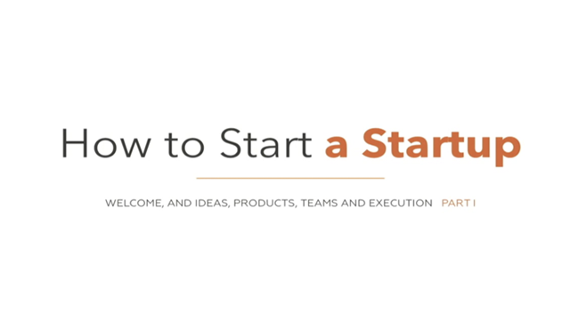

# YC 创业第一课，你真的愿意创业吗？

YC 与斯坦福合作开设了新课程「怎样创立一家创业公司」。课程除了 Sam Altman 本人授予之外，还将包括 PayPal 创始人 Peter Thiel 授予的垄断理论，以及著名投资人 Marc Andreessen、Ron Conway 以及 Pinterest 的创始人 Ben Silbermann 的「怎样融资」等等。

第一节课由校长本人和 Facebook 的第三号员工 Dustin Moskovitz 上阵。正如 Sam Altman 所说，他们在 YC，给创业公司的建议都非常具体，但这么多的创业经验之间存在着 30% 的共性。这是他们第一次尝试记录这些共性。

本文根据 [How to Start a Startup Lecture 1](http://startupclass.samaltman.com/courses/lec01/)  听译整理而成。

现今的媒体把创业描述成为一份非常光鲜、自由的工作，其中存在的误解，让不少人盲目地「为了创业而创业」。Dustin 根据自身经历及经验告诉我们，现实并非如此。

边开派对边工作？

实际上 CEO 的大部分时间都是在办公桌前度过的，他们或思考如何完善产品，或回复用户反馈邮件，或帮助解决工程上的难题。创业面临非常大的压力。创业者的抑郁在最近甚至成为了一个话题，被《经济学家》以漫画的形式登上了杂志。所以这不是危言耸听，是赤裸裸的现实。

创业者的压力，一来自于自身承担的责任。诚然各行各业的人都会害怕失败，但创业者的失败将牵连到跟随自己的职员。有的职员以此谋生计，更多的人则是把自己的时间成本给了公司。创业者必然是希望能不要辜负这些信任的。

创业者的压力，二是来自于工作变成了一个全天候的事情。当你已经就寝，或正在渡假，或一个平常的周末，一但有状况发生，手头的事情必须全都放下，一切以工作为先。  创业者的压力，三来自于媒体的过分关注。适当的媒体曝光是件好事，但大部分人应该都不喜欢媒体连自己的隐私都暴露。

创业者的压力，最后还有一点来自于，创业者是不可以轻易选择放弃的。一个员工因为各种原因离开公司无可厚非，换做创业者这么做是会受人指摘的。他需要跟公司共同奋斗很长时间。如果公司发展顺利，这个时间可能会是 10 年；如果不顺利，也至少需要 5 年。前 3 年用来意识到公司的前景黯淡，后 2 两年则是在收购公司度过。在这个时间点之前离开，不仅自己利益受损，员工的利益也会受到牵连。

曾经有人说过，一个 CEO 最主要的工作就是调节好自己的心理状态。这句话其实是非常有道理的。

可以享受老板的权力？

当我们在工作的时候经常认为老板将时间和经历花费在了不必要的事情上，自信自己不会犯同样的错误。其实未必。

Evernote 的 Phil Libon 说过：

创业公司的 CEO 并不如人们所想，是公司的顶层人物可以发号施令。实际上你需要对所有人汇报工作，你的员工，用户，合作伙伴，媒体，他们反而更像你的老板，因为你需要照顾到所有人的想法。

员工会对公司的发展各执一词；用户对产品的需求不尽相同。因此，当你觉得你的老板是个傻瓜的时候，他其实只是在抉择要如何平衡「老板们」的矛盾。

如果你当老板，或许周一来的时候还信心满满，胸中有雄心壮志，第二天就可能因为有个重要的员工要辞职而被迫分散心力优先处理紧急事件。

工作时间灵活？

老板的工作时间很灵活，可以制定自己的行程。这听起来的确很吸引人。可实际上，你需要 24 小时待命，工作与生活已经没有界限。这个工作的推动力不仅来自于你自身对产品的热爱，也来自于与你合作的伙伴和投资人的期待。

有些公司声称一周可以只工作 4 天，甚至 12 个小时。如果你只是想在一个很小的领域内做一个小生意，这也未尝不可。可一旦你想要做些许扩展，即便只是招 2-3 个人，也需要全职工作才能应付得过来。

金钱、影响力双丰收？

创立自己的公司能赚更多钱，同时有更广泛的影响力。可实际上，你在初创公司担任重要职位赚得也并不少。

我们可以做个简单的计算： Dropbox 和 Facebook 的估值分别是 100 亿美金和 2 千亿美金左右。如果你在早期加入  （第一百名员工），获得公司 10 个基点的股份，那就分别是 1 千万美金和 2 亿美金（当然你的职位应该是个很有经验的工程师）。就算你在 2009 年加入 Facebook，成为他们的第 1000 位员工，那你也能获得 2 千万美金。这些数字已经非常高了。

那作为一个创业者你能获得多少呢？  我们假设一个照看动物的创业公司在创立后第四年，估值达到 1 亿美金。通常来说创始人能获得 10%，事实上的比例肯定有波动，但这个数据是较为平均和合理的。（如果创始人获得的比例高于这个数字，或许你该考虑分更多利益给员工。）所以，作为创始人，你的身价能达到 1 千万美金。  再假设有个非常了不起的太空旅行项目，在第四年达到了 20 亿美金，则创始人获得 2 亿。

至于影响力，我认为这是与公司的市值直接挂钩的。到一个成熟的大公司，你的影响力会扩大，因为有更加广泛的用户基础（例如 Facebook 和 Google 都有上亿的用户），完整的基础设施，可以随时组成一个有执行力的团队。Brett taylor 作为 Google 的第 1500 名员工，开发了 Google Map。JR 在 Google 开发了 Gmail 内的 chat 对话框，并在 Facebook 的 hackthon 中领导小组开发出了「点赞」功能。这些都是影响力非常广泛的产品，他们都是借助大公司的平台成功。

只有「这个产品不得不做」的冲动，才是正经的创业理由。你应该能感受到这股冲动，并且认为世界上需要这么一款产品，它非得由你来完成不可。你的热情能感染职员，你自己的潜意识里也能认识到，自己是不是真的热爱这件事。

重新衡量过自己的创业动机后，接下来需要考虑的事情就是你的创业想法是否优秀，产品是否完美，团队是否出色，执行是否到位。在第一课中，我们先来谈谈想法和产品。

想法

想法重要吗？

关于创业想法，最近很流行的一个说法是「想法并不重要」。这个理念叫做 pivot，他们认为无论创业想法是否有价值，未来是否有市场，都可以先付诸于行动，再在实践中快速迭代，最终找到正确的定位。这种做事方式从某种程度来说是正确的，因为在实际上手之前，创业者想要准确预测未来每一步的动向是非常困难的。但是 YC 的经验告诉我们，大多数成功的公司在创业初期就有一个明确的目标。即便是那些采用了 pivot 而获得成功的公司，产品每一次的转变依然是在创始人的控制之中，并非漫无目的。想法很重要。

好想法能给为公司职员们亮起一盏绿灯。人们知道要向哪里前进，能给企业带来极大的好处。

*   首先，如果没有一个清晰的目标，你很难让一群人专心、高效地工作。  
*   再者，一家优秀的创业公司需要十年以上时间耕耘。创始人本身也需要一个奋斗的目标以使自己更加投入到事业中。如果创业者对这个想法缺乏足够的认同感，很可能导致中途放弃。创立一家公司的痛苦，需要想法本身带来的使命感抵御。  
*   最后，公司外部的组织也会乐于帮助这样有远大目标的企业。  

好的想法是什么样的？

*   如果有很多创业想法在脑中徘徊，那就选择出现频率最高的那个。因为那往往是你最爱的一个创意。  
*   一个好的主意一开始看起来可能非常不靠谱。Google 提供网络搜索服务，Facebook 提供让穷苦大学生上传自己状态的平台，即便现在听起来这些想法也貌不惊人。当然，当人家觉得这个想法很疯狂时，你自己心里必须对你坚持这个创意的原因如数家珍。  
*   好的创意初始阶段切入点要尽可能的小。  
*   好想法能用一句简单的话解释清楚。  
*   与市场上现有产品有很大的不同，而不是只在设计或所涉及的领域微创新。  
*   从受众的需求出发。  

怎么获得想法？

获得一个杰出的创业想法是需要练习的。Paul Gram 会在下周的课程中分享这部分内容。

关于市场

当产生一个创业想法，分析市场的重要性很容易遭到忽略。除了产品本身，产品面向的市场目前规模如何，未来有没有拓展的潜力，以及公司将来的发展路线等等都必须考虑到。其中对未来市场的预测尤其重要。包括很多投资人都会犯一个错误，就是他们太关注产品本身和市场目前规模，但却忽略了产品在十年内可能的发展。一个规模虽小但在迅速扩张中的市场要好过一个规模大却发展缓慢的市场。发展市场中的顾客，面对自己的需求急需一个解决方案。他们会因此愿意容忍一个尚不完美的产品。产品和市场在这种情况下可以同步发展。作为学生有一个优势，就是对这种有发展潜力的市场有较高的嗅觉敏感度。

产品

有了一个自己热爱并且有市场潜力的创业想法之后，下一步就是创造出一个优秀的产品。只要产品足够优秀，满足用户的需求，融资、公关等后续操作就会水到渠成。

如何创造出优秀的产品？

*   在 YC 我们是这么做的：创始人每天除去吃饭睡觉、锻炼身体，剩下的时间全都用来不断重复「与用户交流」，「根据反馈改进产品」这一循环。创业者需要这样一个把用户的反馈转化成产品的机制。首先，不要试图通过 Google Ad Words 寻找你的目标用户。请在现实世界中找到一个对产品有认同感的人，将他招入公司。观察他使用产品的习惯，询问他是否喜欢，是否愿意为此支付费用，是否会向朋友推荐这款产品。分析用户的需求后，改进产品。新产品再由用户试用，提交新一轮的反馈。这个反馈循环应该存在产品的整个生命周期中。同时注意，这项工作必须由创业者亲自完成，不可借由员工之手，因为这是了解自己目标用户的绝佳途径。  
*   先让一部分人爱上你的产品。当有一批初始用户非常热爱你的产品时，他们会主动向身边的人推荐。这样不断发散开来，用户数就会飞快地增长。可如果一开始只有一部分人对你的产品表示还行，那他们后续也很难从这份「还行」，发展到热爱。若用户数没有自然增长，说明产品尚不够优秀。不要忽视这个现象，并抱着侥幸心里，只顾坐等合作伙伴的援助。  
*   产品要简单点再简单点。产品日后的设计可以非常庞大，但在初始阶段一定要简洁易用。想想只有一个输入框，两个按钮的 Google，你就能明白。简单的产品还有一个好处，开发者能在一个领域将一个性能做到机制。这在日后会成为用户爱上产品的理由。  
*   CEO 的考核标准，就是公司未来的样子。所以要用能衡量未来发展的指标，来评判公司的现状，并对结果诚实。这些指标包括，活跃用户数，活跃程度，用户留存率，收入，净推荐值等。  

本次课程推荐的相关书籍：

*   The Hard Thing About Hard Things 
*   Zero to One 
*   The Facebook Effect 
*   The 15 Commitments of Conscious Leadership 
*   The Tao of Leadership 
*   Nonviolent Communication