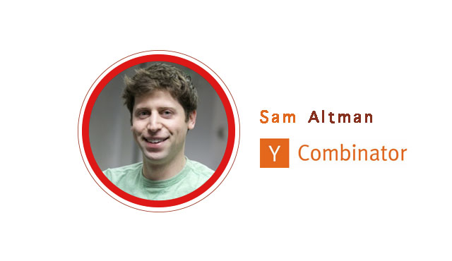

# YC 创业第二课，团队与执行

在[第一节课](http://tech2ipo.com/87754)中，Dustin Moskovitz 告诉我们创业者需要将全身心都投入公司，面临很大的压力，一定要再三考量自己的创业动机；Sam Altman 则谈了想要获得成功的四个要素中的前两项，创意和产品，今天这节课就接下来聊聊后两项，团队与执行。

本文根据 [How to Start a Startup Lecture 2](http://startupclass.samaltman.com/courses/lec02/) 听译整理而成。

**团队**

**1\.** **团队** **--** **寻找合伙人**

根据 YC 的经验，导致企业在早期失败的原因，第一位就是合伙人之间有矛盾。合伙人的重要性大家心中似乎都不言而喻，可到实际操作中，不知为何，谨慎程度常比招聘员工时还要低。尤其是学生，偶然遇到有类似想法的人，就看似一拍即合地开始创业。这对公司未来是个很大的隐患，因为你根本不熟悉自己的合伙人。YC 遇到过一些这样的公司，比例大概是 75 家中有 9 家，这 9 家公司甚至都坚持不过一年时间。

**怎样的合伙人是合格的**

首先你必须熟悉他，了解他的做事风格。

再者，这位朋友最好是像 007 一样无所不能的存在。说这句话的意思是，合伙人最好像 007 一样不屈不挠、足智多谋、明辨是非、勇敢果决、创造力非凡。这听起来好像不现实，但重点其实在于，与综合素质略胜一筹的人合伙要好过与只专注于某特定领域的专才合伙。

两个合伙人之间最好能优势互补，例如如果你不了解技术，就找个技术合伙人。

**要到哪里去寻找这样的人**

做为学生一个很大的优势，就是可以在学校里寻找到志同道合的伙伴。另外如果在类似 Google，Facebook 等大的科技公司实习过，里面认识的同事也是很不错的选择。

**找不到怎么办？**

你可以一个人创业，找不到合伙人比与一个不合适的人共同创业要好一些。不过在成功的创业公司中，拥有 2 人或以上的还是占大多数（YC 前 20 家最具价值的公司都是如此，他们认为最佳的人数是 2-3 人）。

**2.****团队** **--****提防过度招聘**

在创业初期只招需要的人，让公司保持在一个较小的规模。在外人眼中，一个公司拥有多少员工能从某个侧面反应出公司的状况。所以拥有很多员工似乎是个令人骄傲的事情。这种「挣面子」的心情还是挺难以抵抗的。但要认识到，人员过多对创业公司初期来讲并不是件好事。公司每月的支出会因此增加，员工之间的关系也会变得复杂，继而决策的执行效率都会降低。如果因为草率行事而招到不合适的人员，也有招致毁灭性打击的可能。当然这只是初期，后期可视公司需要继续招聘。

Airbnb 花了 5 个月才招进第一个人，他们第一年只招了 2 人。在开始招聘前，Brian Chesky 和他的团队列下了他们希望自己每一个员工都能具有的品质。第一条是，你必须认同 Airbnb。另外有一个疯狂的问题是「如果你被诊断出只剩一年的生命，你还会加入 Airbnb 吗？」。这个问题后来连他们自己都觉得太过分了，就改成了 10 年。

公司招聘了员工，员工定义了公司，所以员工对公司的信心非常重要。如果有机会接触 Airbnb 的前 15 位员工，你能感受到他们对公司的归属感。这个现象是非常难得的。但是通过放慢招聘速度，抬高准入门槛，其实所有公司都能做到这一点。

**3.****团队** **--****招聘员工**

**只招最优秀的人**

平庸的人无法缔造伟大的事业。创业者总是认为自己的主意很优秀，会有很多人愿意加入。而实际上招人是一个非常漫长的过程，花 1 年时间招 1 个人也不足为奇（招聘占据的时间最好能保持在 25% 左右）。在此期间，不要因为挫折而降低招聘的门槛。若是前 5 个员工中有 1 个平庸的员工，很可能就会毁了公司。在大公司中，一个人的影响力没有这么大；但在创业公司，每个人的动作都会直接影响到公司层面。

**到哪里寻找**

同合伙人一样，最好能招你了解，或其他员工了解的人。实际上在科技公司中，前 100 位员工通常都是通过内部推荐的方式获取到联系的。创始人们会带头询问每一个他们认为优秀的人是否有加入公司的意愿，底下的员工也同样会这么做。如果你加入 Google 或者 Facebook，那入职后的第一件事，就是被 HR「严刑逼供」，是否有适合加入公司的人选。

还有一个方法是到其他地方去寻找。在本地工程师可能非常紧俏，但把眼光放宽到世界，就能增加很多选择。

**用什么标准衡量一个人是否优秀**

1.  聪明  
2.  有行动力  
3.  相信自己的直觉，判断是够愿意与之一起共事  
4.  有良好的沟通能力，一方面能清楚表达自己的想法，另一方面能倾听他人的意见。  
5.  愿意承担风险。其实愿意选择创业公司本身就是愿意承担风险的表现，但创业是最近比较时髦的话题，难免有盲目从众者混入其中，所以还是要确保对方的确有承担风险的心理准备。  
6.  有狼性。努力在自己的领域内做到最好，没有什么能够阻挡。  
7.  Mark Zuckerberg 有两条招聘原则，一，跟应聘者在私底下也合得来；二，如果自己是员工，愿意跟随像应聘者这样的上级。  

**经验重要吗**  

工作经验对那些掌管公司大部分业务的职位很重要，但对某些职位的影响却并不大。所以在招聘过程中，应聘者在相关领域的经验是否重要，需要具体问题具体分析。Sam Altman 的经验是，创业公司早期的招聘中，态度比经验更重要。他做下的最明智的几次招聘决定，对方在相关领域都没有经验。

**面试**

许多创业者不懂得面试技巧，所以最佳的选择是，与候选人一起工作 1-2 天，完成一个小项目。这样不仅面试者能做出准确评价，候选人自身也能感受到是否与公司合拍。

如果不得不进行面试的话，就不要问一些所谓的「智力题」，而要详细询问应聘者之前做过的项目的具体情况。接着可以给应聘者之前的工作单位致电，问题不要太宽泛，可以显得咄咄逼人一些。例如，「你觉得某某在你一起共事过的人之中能排前 5% 吗」，「他在就职期间具体做了什么」，「如果有机会，你愿不愿意再次聘用他」。

**股权的分配**

粗略估计，前 10 位员工理应获得约 10% 的股份。创业者不需要在他们刚加入公司时就给出这么多股份，时间可分为 4 年。在此期间，他们一定会为公司创造出更加巨大的回报。

在股权的分配问题上，不要对投资者太慷慨，而对员工太吝啬。毕竟投资者给完钱后基本上就什么都不做，而员工将是与创业者一起缔造公司历史的人。

至于合伙人之间的股权分配，Sam 认为应该在初期就把这件事定下来，每个合伙人的股份应大致相等。

**4.****团队** **--****留住人才**

这个话题在之后的课程中会详细讲述，在此处先略带一提。  

留住人才的根本就是要让员工工作得开心，并且感受到公司对他的重视。要做到这点，首先就是上文所说，要合理地分配股权。员工刚加入公司时的兴奋感是会被时间消磨的，如果他们觉得自己在公司的贡献没有获得公平的回报，完全可以一走了之。其次，要学会赞扬自己的员工。建议创始人们学习一些管理上的知识，有些我们认为自然的行为对于一个老板而言是不可取的。作为一个管理者，要勇于承担责任，也要学会把成功的荣誉归结于自己的团队。  

**5.****团队** **--****果断取舍**  

不合适的人要果断放弃，不要花太长的时间等待他们去改变。那么怎样的人是不可取的呢？1，屡次无法完成自己的本职工作；2，热衷于办公室政治；3，总是抱有悲观的情绪。

**执行**

CEO 需要做的事情很多，这边重点提及的是，CEO 要保证公司向着既定的方向发展，确保所有已完成工作的质量符合公司标准。想做到这一点，有如下三个建议：

**1.****执行** **--****创始者本人起到带头作用**

创业者会将自身的做事风格带到公司中，员工们会一切按照创业者的标准来。所以，如果你希望自己的员工能努力工作，注重细节，处理好与顾客之间的关系，首先自身就要起到带头作用，把这些事情做好。不要通过招聘 COO 解决这些问题。

**2.****执行** **--** **专注于最重要的事**

每天会有成千上万个问题涌到创始人的面前，这时必须坚定舍弃一些不重要的任务，最后只留下 2-3 件必做事项。对于一个对各种事物都充满好奇和兴奋感的人来说，做出这种取舍很困难。但市场和时间是残酷的。通常每天能完成的任务只有 2-3 个，如果太贪心，反而会一事无成；若对事情的优先级判断错误，最后在错误的方向上努力，那就会被市场淘汰，没有任何宽容。

**哪些事情是最重要的**

那些有关维持公司成长的事情是最重要的。团队经常会因为公司的公关活动兴奋异常，其实这些活动对公司的贡献可能微乎其微，不过是看上去很美而已。

**创业者需要怎么做**

创业者需要设定出一个总体目标（例如增长率达到多少多少），并在团队面前反复提及，让所有人都铭记于心，在目标的驱动下工作。另外不建议团队成员分布在不同的地方，远程工作的效率非常低下。

**3.****执行** **--****保证工作强度**

创业需要创业者全身心的投入，在工作之余放弃掉许多事情。所以对于想把握工作和生活的平衡的人来说，创业不是一个好选择。但是一旦努力对了方向，每一份投入一定都会有所回报。假设你的产品是一个网站，只要平均每个用户带来 1.01 个新用户，用户数就能进入指数增长；而如果这个数字是 0.99，那网站就终将消亡。同样的，创业者只需要比自己的对手优秀一点点，最终都能带来巨大的差距。

**快速迭代**

犹豫不决是创业公司的毒药。平庸之人总是看上去有很多好想法，但是他们从来不会去实现。没有行动力，只会止步不前。好的创业者是那些能够快速把小事情做好的人。公司的产品是否在不断发展是 YC 用来判断成功最适用的一个标准。即便每次只进步一点点，一年之后也会有很大的不同。不要盼望一步登天的事情发生。如果项目太大太复杂，就分步分阶段完成。

保证产品更新速度的同时，也要保证质量。这就是创业的难点，单独做到其中一项不是十分困难，若想两点都能达到，必须团队中的每一个成员都做到要求高，执行快。

**不要失掉前行的势头**

初创企业只能不断向前，一旦停滞或倒退，团队很容易乱了阵脚，陷入失败的恶性循环。如果这种情况真的发生，不要妄想给自己的团队灌输鸡汤就能走出这个循环，此时需要打赢一些小仗（例如提升销售量）来挽回团队的信心。在失去势头之后，团队内部会很迷茫，对公司的发展方向会出现各执一词的情况。此时暂停争论，听从用户的建议会是最好的选择。如果在创业初期就定下新产品的发布节奏，对将来保持前行动力会有非常大的帮助。如果团队中的慌乱是由竞争对手施予的压力造成，创业者要承担起稳住军心的责任。告诉自己的团队，只有专心做好自己的产品，才是获得胜利的王道。