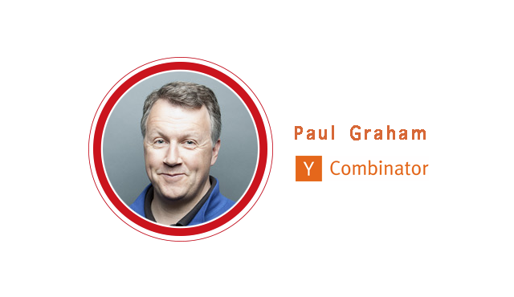

# YC创业第三课，与直觉对抗

这节课，YC 创始人 Paul Graham 告诫我们创业像滑雪，不可靠直觉行事；创业亦如为人父母，20 多岁的我们真的准备好了吗？

本文根据 [How to Start a Startup Lecture 3](http://startupclass.samaltman.com/courses/lec03/) 听译整理而成。

**创业如滑雪**

本能反应在这里是行不通的。

滑雪时若想减速，身体的本能反应是向后仰，可实际上这样会失去控制。所以对于滑雪来说第一课就是学会克制住这种本能的、但是错误的冲动。通过不断的训练，最终正确的滑雪姿势会成为新的「本能」。

若去学习滑雪，教练会告诫「不要用脚，要用身体的力量控制速度」，「上半身微弯前倾可降低重心」等等，对于创业来说也存在这样一个「须知列表」。这个「须知列表」我们在创业课程上能略知一二，但正如在真实世界中教练和运动员是两个不同的角色，这门课程拿 A 不是成为优秀创业者的保证，因为首先创业者本身很难发现这种错误，再者这种犯错的冲动是很难克制住的。只有在实战课程「了解自己的用户」上拿到 A 才是正道。YC 的作用，就像滑雪教练，凭借经验更客观、准确地指出错误。

实际上，Paul Graham 不担心我们对创业的门道了解得太少，真正让他担心的反而是人们太懂得「怎么创业」了，也就是把时间都花费在寻找所谓的创业攻略上，比如「说服投资人的三百个谈话技巧」，「高速成长秘诀」之类的所谓诀窍。可创业不是像打游戏，所有人重复同样的流程就能成功。创业者需要找到的，是自己特有的对用户的价值。创造出优秀的产品，其他的事情就会自然而然地发生。打个比方，国内有许多英语培训班，老师分析大量的题目，揣摩出题套路，答题技巧，可偏偏对真实的英文能力提高不屑一顾。这些技巧或许对考试成绩能起到短期的应急作用，但在现实世界的运用中对人的帮助就捉襟见肘。同样的，这些小聪明在帮忙拉投资或者招聘时真的能起到一些作用，但如果产品不够优秀，终究是要露馅儿的，而之前所做的努力就变成让自己浪费更多的时间而已。所以要时刻记住，创业者唯一的任务就是创造出用户喜欢、需要的产品，不要做自欺欺人，浑水摸鱼的事。

在说过不要轻信自己的直觉后，可能会有读者开始无所适从，感觉自己做的所有事情都是错的。首先我们要接受犯错是无可避免的；再者，在待人接物上直觉依然靠得住，因为这一点我们在平常生活中一直在练习。如果一个人从客观条件看起来很不错，但给人说不出的奇怪的感觉，那么这种看似太过主观的感受并不应该被忽略。另外有工程背景的同学经常有个误区，就是觉得商业一定是无趣的，所以当他们遇到一个聪明但不有趣的候选人时，就会对自己说「做生意就是这样的」，以此为理由妥协。实际上正如前几节课所说，必须按照找朋友的标准找合伙人，彼此要互相了解、尊重，合得来。

**创业如为人父母**

小孩儿会使人生发生巨大的改变，而创业给人生带来的改变不比为人父母小。

首先创业要求创业者投入所有的精力，并且这种状态会持续很长时间（如果成功，说不定会直至退休）。所以决定前一定要再三确认，自己真的愿意把所有机会成本都献给这个事业吗？Larry Page 从 25 岁开始就没有停止忙碌过，在 Google 帝国中，很多事情非他处理不可。他当然可以给自己的放假，只不过需要解决的事情会堆积如山，假期结束后将面对一个更加沉重的负担。不仅无处可逃，还无处可抱怨。（一个千万富翁抱怨工作繁忙难免给人装逼的感觉。）尤其是公司成功，事情只会更多，不会更少。

关于结婚生小孩，大家似乎都脑袋很清醒，知道自己「还没有准备好」，「小孩子会占去生活的很大一部分，有许多事情只有在生小孩之前才能做」。可一到创业，就脑子发热，一个个都要退学去创业。Paul Graham 不建议在大学期间就去创业，如果真的成为了第二个 Mark Zuckerberg 那就再也没有说走就走的旅行和一些只有年轻人有资本去做的事了。每当我们掌控一个事情，相反的，也必定会被这个事情掌控。如果还有许多事情想去尝试，那就先不要创业。Facebook 的神话给人带来很多误区，觉得创业人都是 20 岁出头，要是不趁着这个年纪创业就再也没有机会了。实际上很多成功企业的创始人也并不年轻，LinkedIn 的创始人们创业时平均 36 岁，Workday 则是 52 岁。经历更多，更成熟，能够让你成为更加合格的父母，也能让你成为更加合格的创业者。

既然如此，如果有朝一日有创业的可能，那现在在校的各位应该做些什么呢？正如 Sam Altman 在之前的课程中所述，在校期间是寻找创业想法和创业伙伴的最佳时刻。但此处的「寻找」不是说让你绞尽脑汁地思索，而是去感受，去追寻自己感兴趣的东西，投入其中，和志同道合者一起做出些成果，忘记关于创业的事。很多伟大的公司都是从一个小项目成长起来的，一开始创始人甚至没想过要以此创业。就 Paul Graham 本人而言，他只愿意做自己认为有趣的事，一开始并没有考虑太多但结果总是出人意料地有利。似乎冥冥之中有个罗盘会指引方向。科技是一棵茂盛的树，它遍布社会的各个领域，一定有某一个尖端属于你。

**Q&A**

Q：非技术人员如何最大程度发挥对公司的效益？

A：  如果你的产品有自己的所属行业，那非技术人员对公司就非常重要。例如 Uber，对这个 App 来说，一个在租车行业有经验的创始人比只需要开发出应用程序的技术人员对公司的作用更大。如果是纯粹的技术性产品的话，非技术人员可以负责对外的活动。

Q：有必要上商学院吗？

A：没有必要。商学院是教你如何管理公司的，一个创业公司尚且不需要太多的管理技巧。一开始招进来的人原本就不多，并且那几个人应该当作共同的创始人来看待，而不是需要管理的员工。去商学院，不如去相关领域的公司实习。

Q：你觉得我们现在身处科技泡沫中吗?

A：我认为现在提出科技泡沫纯粹是媒体闲得无聊。估值高并不意味着就是泡沫。90 年代那会儿，人们是恶意炒高估值以从中谋利。现在的情况并不是这样。

Q：把小项目发展成创业公司的时机如何挑选？

A：你能够感受到这个时机。通常这个时候项目会占据了你大部分时间，甚至你都忙得无法顾及到自己的学业。

Q：如果只找自己喜欢的人，公司的文化会不会太单一？

A：首先你要接受，创业不是完美的。跟所谓的公司文化单一比起来，还是找自己喜欢一起共事的人要重要得多。

Q：怎么找到那个「对」的领域？

A：尝试接触这个领域最前沿的观念和产品，看看是否无论人家怎么认为，你都能为此感到激动万分。