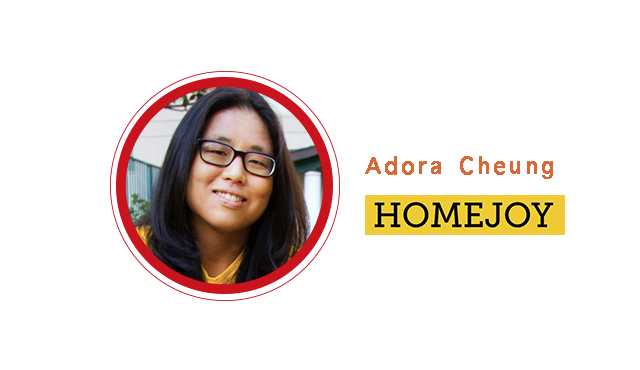

# YC创业第四课，如何积累初期用户

YC与斯坦福联手开设的新课程「怎样创立一家创业公司」第四课，由 Homejoy 创始人 Adora Cheung 开讲如何积累初期用户，以及她在数次创业经历中的收获和教训，希望创业新人能引以为鉴。

本文由 [How to Start a Startup Lecture 4](http://startupclass.samaltman.com/courses/lec04/) 听译整理而成

谢谢 Sam 邀请我来给大家讲讲如何积累初期用户。

我在 2010 年加入 YC，之后三年，Homejoy 的定位历经数次修改，有进有退，也不乏全盘推翻再来的情况。有了这些年的经历，如果重新创业，有许多错误我不会再犯。今天就是希望大家能以我为前车之鉴，知道什么该做，什么不该做。有一句老生常谈的话希望大家能时刻记住，每个人，每次创业都是不同的，我只能给出一个大致的方向。

对于学生创业者，我想说，最好能像做项目一样，每周抽出 1、2 天时间专门用于创业。这比每天抽出一两个小时要高效，跟编代码是一样的道理。

有部分创业新人可能会觉得「这个主意很棒，但还是等开发得差不多了再拿出来让其他人大吃一惊吧。初期只要少数几个人知道就好了。等产品足够好了就能上 TechCrunch 之类的媒体，然后就会有很多人来用了。」可实际上，因为你初期没有大量地去获取用户反馈，就算靠媒体曝光后吸引了一部分用户，也很容易流失。这时银行里还有资金的人可能会想通过分发广告获取用户，但是结果也好不到哪里去。这是个恶性循环。我自己就做过这种蠢事。我当时甚至没有在 TechCrunch 上发布自己的产品，这在现在看来可能难以想像。

在评估创业想法时你需要好好想想你的产品到底能解决什么问题。这个定位应该是一句话就能清晰地概括出来的。然后再问问自己「我自己有这个需求吗？我对解决这个问题充满热情吗？其他人是否跟我一样也被这个问题所困扰？」对这些提问有了自己的答案之后，再出去找不同的人聊天，验证自己的想法是否正确。

我跟我的合伙人，也就是我弟弟，在 09 年、10 年左右创建了 Pathjoy，当时的想法是创建一个能让人开心并且有影响力的公司。要做到后者其实只要把公司做大就好，所以我们把重点放在了「能让人开心」上。那有哪些人能做到「让人开心」呢？「人生教练和心理咨询师吧！」（人生教练即通过社会学、心理学等对他人进行指导，助人达成人生目标，国内尚未引进这个概念）我们拍脑袋想出了这个主意，然后就着手开始做寻找人生教练和心理咨询师的网络平台。可我们做了一年之后才发现，即便是我们自己遭遇困境时也不会想要去寻求人生教练和心理咨询师，这不是我们的热情所在。所以起步前就好好考虑这个问题吧，这样在接下来的发展道路上才不会觉得哪儿哪儿都不对。

当你权衡过自己的创业想法后，接下来可以去了解这个行业。怎么去了解呢？有几个方法，

**一，****成为行业里的一员。**这或许与你们的直觉反应向违背，因为很多人会觉得如果你想破旧立新那就不要到既有的产业中去，因为呆上个 20 年、30 年你就会习惯产业中的各个环节，形成固定的做事套路，继而再也不能像一个外来者一样看到这个产业不合理、低效的地方。可其实你只需要在产业中呆上几个月，在这几个月中以外来者的身份重新思考每一个环节，这就是你发现这个行业可改造之处的机会。

Homejoy 创始之初，我们自己以清洁人员的身份进入到这个行业。当我们发现自己不擅长清洁工作后就买了很多相关书籍。这跟打篮球是一个道理，纸上谈兵不会成为好球员。后来我们除了对清洁器具了解更多外别无所获。于是我们决定加入一家家政公司，跟专业人员学习怎么做这一行。加入公司后，我最大的收获就是了解到了一家传统的家政公司是怎么运作的，并且看到在客户预订、清洁人员时间安排等等方面他们都是非常低效的。这也是他们无法做到 Homejoy 今天这么大体量的原因。

同样的，要是做有关餐厅的产品可以试着做服务员，跟装修有关就试着去做油漆工，总之就是站在目标客户的角度去考虑方方面面的事情。

你最好能有点强迫症，带着强烈的好奇心去了解这个行业。搞清楚公司里每个人都在做什么，这个领域每个环节的每个人都在做什么。再列个所有可能潜在对手和类似公司的清单，把他们在 Google 上搜索结果的前 1000 个条目一一阅读过去。我本人就是这么做的，并且如果遇到上市公司，我还会读他们的 S-1 文件、每季度的财务报表，还会参加盈利电话会议。这种方式获取有效信息的效率可能比较低，但有些干货只能通过这种方式获得。积累一定的干货后你才能成为真正懂行的人，继而获得他人的信任。

**二，****确定产品面向的客户群。**一个产品最最理想的状况当然是世界上每一个人都在使用，不过在现实中还是选取某一特定人群切入，根据他们的需求优化比较明智。因为这样才能把力气都使在一处。

**三，****在你着手打造产品之前先预设好用户的使用场景。**所谓使用场景不仅仅包括怎么使用网站，还有用户会在什么场景下发现你的产品，是通过广告阿还是他人推荐；他们登录到网站后会看到什么文字；注册时、购买服务时有什么讯息需要传达；通过你的产品用户能获得什么帮助；在使用完产品后有没有让用户留下反馈的机制等等等等。你需要把整个流程在脑中过一遍，在纸上记录下来，最后再开始着手编程，用代码还原这个设想。

有了想法，找到了目标用户，了解了行业细节，之后要做什么呢？现在可以开始创建产品了。当下最流行的说法是「精益创业」，也就是先做出未来产品最简单可行的版本，其他留待日后再添加、改进。这里要注意的是，所谓「可行的」产品，不是只有孤零零的产品功能，用户体验同样不能忽略。「做出最简单可行的版本」其实并不难，只需再过一遍你脑中预设的用户使用场景，跟用户多沟通，看看现有产品的样子，你的产品跟它们有什么不同，可以解决用户哪些急需。

在把最小可行产品推广给用户之前还需要做最后一件事情—尝试向陌生人介绍你的产品是做什么的，使用者能从中得到什么好处，这些也要简短清晰地用一句话就能表述出来。Homejoy 的这句话就是「20 美元一小时的清洁服务」。

产品最初的用户首先当然是你自己和你的合伙人拉，然后就是你们身边的人，例如父母、朋友、同事。仅有这些人当然是不够的，你需要更多的用户反馈。所以根据产品类型不同可以去不同的地方宣传，如果是开发工具可以选择类似 Hacker News 的线上社区；如果是消费类产品，尤其是一些面向长辈的产品，可以选择当地社区。

Homejoy 创立初期，因为我们的亲朋好友都不在山景城，所以一开始就遇到了瓶颈。直到有一天，Castro Street 上在举行夏日市集，那天特别潮湿闷热，我们就在人群中免费发放冰水，同时邀请他们预约我们的清洁服务。虽然当时有很多人是觉得不好意思拿了冰水还拒绝才预约的，但他们大部分最后都没有取消预约。所以我们才得到了把服务展现出去的机会。这么做转化率是有点低，但初始阶段总得做些不计付出的事。

对于这些初期开始关注产品的人需要做些什么呢？首先你要确保有让他们反馈意见的渠道，比如网站上留有电话、邮箱等信息。当然也可以主动分发问卷。但是实际上除非用户超爱/超恨你的产品，否则他们是不会回应的。所以最好的反馈渠道其实是你到线下找到他们，把他们约出来面对面聊一聊，这样你可以最确切地知道产品有哪些功能是鸡肋，又有哪些功能要添加。记住是「聊一聊」，不要弄得像做调研一样咄咄逼人，让人不自在。气氛轻松用户才会透露真实的想法。

另外建议记录用户的留存率，今天有多少新增用户，他们中有多少人第二天仍在使用，第三天，第四天，不断记录下去。最常见的时间间隔是一个月。也就是今天新增的用户，一个月后是否还在使用产品。一个好的创始人工作中很重要的一部分就是记录这些用户的反馈和对产品的评级，例如从 0-10 中选择一个数字表示你会不会向朋友推荐这个产品。这些数据就是公司发展状况的代表，创始人可以根据数据判断下一步该如何行动。

不过在收集数据时要注意到，有些反馈可能是不真实的。比如你妈妈，她可能为了鼓励你就只说产品的好话，而一些随机的用户可能只是很随意地回答问题；如果你的产品是付费的，那情况又会有所不同，此时能给出最真实反馈的就是那些付费用户，他们会主动判断思考，这个产品到底值不值得付出那么多钱。

当获得了一定数量的用户反馈后可以考虑产品下一个阶段需要拓展哪些功能了。不需要考虑得太遥远（在只有 10 个用户的时候考虑有 1 千万用户时的功能是没有意义的），你只要考虑用户到达 100 人时需要提升什么就可以了。初期有很多事情都需要亲力亲为，不要忙着写个程序替代自己看似重复的工作。Homejoy 面试清洁人员的时候就是先电话面试，再现场面试，最后还有个清洁测试。这样一轮走下来，面试的通过率只剩 3%-5%。这样经过几次之后，我们就能发现合格的清洁人员之间一些共有的特质，这个时候可以根据之前的经验编写程序进行初步筛选了。

在产品迭代阶段，先不要担心一些极端情况发生，他们发生的概率很小，并且到下一代产品中这个问题可能就不存在了，所以一切以确保核心功能的完善为先。等产品发展到一定阶段，一些极端状况自然会变得更加重要，可到时再进行处理。

最后需要注意的是，不要盲目讨好你的用户。他们给的反馈只是在某种程度上反应了自己的需求，你需要自己分析他们到底需要什么。通常他们不会给出最好的意见，所以不要用户说想要什么，就一股脑地全往产品上加。

产品初步完成后有些人可能因为害怕竞争对手抄袭而延缓发布时间，想要尽量让产品更成熟一些。这有一定的道理，但是若因此错过获得大量用户反馈的机会我觉得是得不偿失的。其实不管你在什么阶段发布产品，要抄的人还是会抄，只不过他们需要更拼命赶上你的进度。

获得大量用户增长有很多方法，我接下来马上就会讲。在此之前我想告诉各位，当公司还是个小团队是，不需要特意额外成立推广团队。这件事由一个人来负责就够了。一次专注尝试一个渠道，一段时间后若其有效就继续沿用，无效就放弃换下一个。不过一时的判断适用时间并不长，你要不断重复评价一个渠道是否适用。原本可行的可能因为政策变动效果打折，原本不可行的也可能因为产品本身的发展而更加契合。推广其实就是在比拼创意，找到人家都注意不到的点，再发挥到极致你就能取胜。

**扩大用户数的三种方法，**

**第一是粘性增长**，也就是让现有的用户在产品上花费更多时间，并且愿意付更多钱选择更加高级的服务。这需要你的产品足够优秀，优秀到让用户产生依赖。粘性增长情况可以从 CLV（用户生命周期价值，即在一段时间内单个用户带来的利润）和用户留存率看出好坏。

**第二是口碑营销**，也就是通过现有用户的推荐，一传十，十传百。这对产品的要求其实更高，你想一个人要是在自己的社交网络上向家人朋友推荐一个东西，他自己首先肯定要对此非常狂热。除此之外你要为用户建立起推荐的入口。比如很多软件在用户刚开始使用时会有个对话框弹出询问是否向朋友推荐（虽然不太友好）；有的是在使用一段时间后再弹出这个对话框。Homejoy 的做法是当清洁人打扫完毕后，留下一张传单。总之就是找到用户正在深度使用产品，并且对产品感觉良好的那个时间点。还有一种推荐机制是，如果你推荐给朋友，朋友注册了，那你和朋友都能获得 10 美金。具体金额可以根据自己的财务状况和推广效果调整。

**第三是付费增长**，也就是通过投入广告获得用户增长，这个方法比较适合资金充足的阶段。在这里你要分析通过每条广告点进来的用户转化率，生命周期价值还有获取单个用户的成本。很明显，单用户成本低又能带来高盈收的才是合适的广告渠道。另外最好能够划分开不同的用户群分析这些数据，比如你要是做一个乡村音乐的产品，那田纳西和纳什维尔的单个用户一定会创造更大的价值。还有一点是，一个用户 12 个月的周期价值是 300 美金，但是他在最初的一个月只会拿出 100 美金，另外的 200 美金要等一年后你才能获得。如果这个时候你前期在广告上的投入过大，很有可能就撑不到收回资金的时刻。不过这实际上是个权衡风险的过程，一切看你们的个人选择。比较安全的做法是把这个周期定在 3 个月左右。

Homejoy 实际上已经是我最初创业想法的第 13 个版本了。经常就会有人问我「你都是在什么阶段知道自己的想法行不通了，然后换条路走的呢？」我认为最主要的就是你发现公司的发展不如你的预期。通常来说创业公司一旦成功启动，用户就能逐渐成指数增长，如果你觉得自己已经把所有该做的事情都完成了，还是没有用户来使用，那就该考虑产品在某些大方向上的调整。不过用户的增长当然不会完全符合数学模型，期间有各种波动是正常的。在波动的低谷你要看清楚增长的趋势，不要轻易放弃。

**最后回答一个网络上的提问**，

**Q****：**如果用户已有惯用产品，什么办法能让他转而使用你的产品？

**A****：**找到对方产品的空档。比如某用户在派对后，一时无法预约到传统清洁公司，这时 Homejoy 却能够提供服务，然后你的产品有非常鲜明的特点让他印象深刻。最后在细节上的一点点优势叠加起来，用户就会开始倾向于使用你的产品。