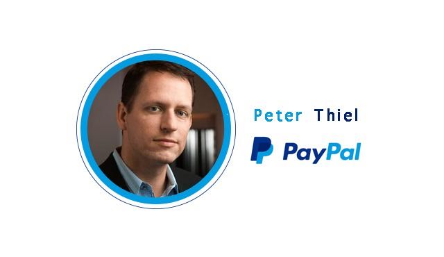

# YC 创业第五课：失败者才谈竞争

YC与斯坦福联手开设的创业课程「怎样创立一家创业公司」第五课，由 Paypal 创始人 Peter Thiel 谈谈他认为最为人忽视的一个现象，「失败者才谈竞争，胜者只求垄断」。

本文由 [How to Start a Startup Lecture 5](http://startupclass.samaltman.com/courses/lec05/) 听译整理而成。

对于商业我有个偏执的想法，那就是，失败者才谈竞争，胜者只求垄断。

公司能挣多少钱，一个要看创造了多大价值，即营收；另一个是扣除各项成本支出后剩余的价值，即利润。这两个概念我们都明白，但有时候我们会忘记，这两项价值的高低是没有必然联系的。一个营收额巨大的公司，其获取的利润率可能很小；同样，一个公司即便营收额规模中等，只要利率高，也能成为大公司。所以在我们看到一个市场很大时，也要考虑到我们能从中获得多高的利润。举个例子，在人们的第一反应中，美国航空行业的整体规模和重要性肯定都是要高于 Google 的。的确，到 2012 年，所有美国航空公司的总营收将近 1950 亿美金（美国范围内），而 Google 只有 500 亿美金。可实际上，在航空行业发展的几百年里，累计利润是趋近于零的。2012 年时这个数字是 0.2%，Google 却能达到 21%。这也就是为什么 Google 的市值（3938 亿美金）要远高于美国航空行业市值（1124 亿美金）。

在我看来这个世界上只有两种公司，处于完全竞争市场中的公司，和垄断公司。现实世界中这两者的区别看起来并不明显，因为垄断公司为了避免触及法律总是对外宣称自己所处行业竞争非常激烈；而市场竞争激烈的公司则喜欢通过强调自己在市场中的独一无二来彰显个性或吸引眼球。我再举两个例子来说明这两种公司具体是如何伪装自己的。Google 作为一家搜索公司，占领了市场 66.4% 的份额，这个数字比微软在 90 年代的市占率还高，明显 Google 是搜索领域的垄断企业。但他们不会说自己是一家搜索引擎公司，他们时而说自己是广告公司，要和全世界广告行业里的公司竞争；时而又说自己是科技公司，在无人车领域要和传统汽车公司竞争，在智能手机领域要和苹果竞争，在社交网络领域则需要跟 Facebook 竞争，听上去真的是前有狼后有虎。至于处于弱势的公司，我爱举餐厅的例子：假设在 Palo Alto 有一家英国餐厅，他们经营不善，但是对外他们会信誓旦旦宣称自己是 Palo Alto 唯一的英国餐厅。这句话没错，但他们所做的，只不过是用 Palo Alto 和英国菜两个属性把定位限定在一个很小的市场中以抬高自己。可实际上呢，吃英国菜的人很少，并且山景城等周边区域也有英国餐厅，它并不是这个区域里人们唯一的选择。

**下面来讲讲怎么缔造一个垄断型公司。**

其中最重要的一点就是，不要试图一步登天，创立初期切入的市场要小。垄断企业即意味着占领大量的市场份额，在一个人人都来争抢的热门市场里，做到这点太难了，在一个不被人注意的细分市场中做到这一点就相对容易，初步站稳脚后，就可以围绕初期业务向外扩张。在硅谷，靠这种模式成功的企业太多了。Amazon 初期就是线上书店，逐渐才发展成拥有各种产品的大型电商；Ebay 从拍卖糖果盒子拍卖绒毛玩具，一路发展到今天的规模；Paypal 开始时只服务于 Ebay 上大约两千个超级卖家，我们有一段时间觉得人们在网上卖的都是破玩意儿，这个市场太小太糟糕了，非常沮丧。可我们的确方便了市场双方的交易，有存在的价值，最终市占率在头 3 个月就达到了将近 30%，品牌形象也得到了认可；Facebook 初期的市场定位只限于哈佛大学的 1 万个学生，即便在 10 天之内就有超过六成的哈佛学生开始使用 Facebook，在外人看来，它还是不可能发展成一个大公司。这些企业在初期的切入点都很小，小到大家都不觉得会成功，当时商学院的人都觉得 Facebook 是不现实的，可他们却因为快速抢占了一个新生市场，后期逐渐发展成为垄断型公司。《安娜卡列妮娜》里那句著名的台词「幸福的家庭都是相似的，不幸的家庭各有各的不幸」在商业世界里要反过来说，「不幸的企业都是相似的，幸福的企业却各有各的不同」。

**如何成为下一个垄断型公司？**

1.  科技的发展亦如历史的长河，所有事件只会发生一次。下一个 Bill Gates 不会再去做操作系统，下一个 Mark Zuckerberg 不会再去做社交网络，下一个 Larry Page 也不会再去做搜索引擎，你需要去探索一个前人没有做过的全新领域，改善人类的生活。例如 Amazon 能够比传统书店更高效、大量地卖出书；Paypal 让交易更加便捷；iPhone 提升了智能机给人的体验。  
2.  有成为垄断型企业潜力的公司往往能引发连锁反应。不过走出第一步永远是最困难的。  
3.  能形成规模经济。如果一个项目固定成本高，边际成本低，那也是有成为垄断型公司的潜质。  
4.  还有就是产生品牌效应。我本人对品牌效应的产生还是不太能理解，所以从未投资过这类公司，但是我认为品牌效应的确也能产生实际价值。  

软件公司其实很符合这几个特点，尤其是形成规模经济这点，因为软件公司的边际成本是零。如果一个商业模式在互联网上行得通的话，那它往往会比现有的解决方案要高效，这就带来很广阔的成长空间。即便现阶段市场很小，公司正好可以跟市场一起成长，一直保持住垄断的地位。不过这点是很难做到的。在硅谷，大家都想做第一个实践新想法的人，但我觉得更好的愿景是长盛不衰，成为这个行业里最后一家公司。就像 Microsoft 在很长的一段时间里是操作系统领域的最后一家公司，Google 是最后一家搜索公司，或许 Facebook 会成为最后一家社交网络公司。这些公司之所以能做到这些，是因为他们还在不断地发展，给人类未来的生活继续创造着价值。在给 AirBnB，Facebook 等科技公司做贴现现金流的分析后可以发现，他们的估值中有 85% 来自于大家对他们 2024 年以后创造价值的估计。

现在我们再看回到垄断型公司的四个特质，全新领域，连锁反应，低边际成本，品牌效应，这四个要素其实都要再加上一个时间维度。在 80 年代时，磁盘驱动器制造是个不段有新事物产生，但是没有人从中挣到大钱的领域。就是因为今天你造出了全世界最好的磁盘驱动器，两年后就被新技术给取代掉了，没有人能够长时间地保持住垄断的地位。你可以把创业想像成下象棋，执白先行的人能够获得 1/3 子的优势，但并不能保证就获得游戏的胜利。就像象棋大师 Capablanca 说的，「在起手时就要预想好结尾」，这也是企业的运行之道，你要对未来的发展有所构思。

最后我想讲点题外话。今天我们所讲的主题「失败者才谈竞争，胜者只求垄断」这一套东西是我看待创业的一个主要观点。在我们 300 多年的科技发展历史中，还有很多其他有趣的观点来看待这个世界。就像我们上文说的，一个产品创造的价值，和创造人从中能取得的回报是两件完全不相关的事。科学界也是这样的。许多科学家做出伟大的发明，可他们的回报率是趋近于零的。爱因斯坦创造出相对论，他没有成为百万富翁；铁路公司因为竞争太激烈而纷纷破产，却对社会产生巨大的价值；怀特兄弟也并没有因为制造出第一架飞机而赚到钱。在过去的 250 年间，我认为只有在两件事情上，创造出新事物的人们是能够获得相应的财务回报的。第一个，就是在第二次工业革命时对垂直领域进行整合的那些大集团，例如福特、标准石油等。他们把产业的各个环节协调地组合在一起后，就形成了自己巨大的优势。这件事情现在已经很少有人在做了，可能是因为我们的文化中就不喜欢太庞杂的东西，但我认为这是很值得去做的。我大学时的好友，Elon Musk，我觉得他所创建的 Tesla 和 SpaceX 就具有这种垂直整合垄断型企业的潜质。因为你看在 Tesla 和 SpaceX 项目中没有任何技术上的历史性突破，Tesla 他们胜过对手的，就是比人家整合度高。第二个，就是现在的科技企业。他们边际成本低所以能形成规模经济，并且市场对其的接受度非常高，所以才出现了硅谷一大批的历史性的科技企业。同样的，回报率高并不说明互联网公司对世界贡献大，回报率高只不过是因为我们处在一个良好的工业机制中。

**提问环节**

**Q****：**怎么判断一个创业想法未来是不是会成为一个垄断型的公司？

**A****：**不要对方给你文字上的描述，因为人们很会玩文字游戏，你要分析出来他实际上面对的市场是怎样的。

**Q****：**你对精益创业怎么看？

**A****：**我个人对精益创业的方式还是持保留意见，因为我觉得伟大的公司所做的事与其他人一定是天差地别，他们不会做大规模的用户调查，有的人甚至有轻微的自闭，不轻易被人家的观点影响。我觉得精益创业太依赖于通过迭代和反馈来修改自己，轻视了通过自己的感官和思考去解决问题。当你花费大量时间去考虑别人到底要什么的时候，可能机会就已经过去了。

**Q****：**成为最后一家公司是不是意味着我在开始时就已经面临着很多竞争？

**A****：**话是这么说没错，但是那些有潜质的公司从某种角度来说仍然是行业里的第一个人。在 Google 之前也有搜索引擎存在，但那些引擎没有在任何一个角度上与他们的竞争对手拉出一个数量级的差距。Google 是第一个自动进行网页排名的搜索引擎。再说 Facebook，我有个朋友在 Facebook 之前就提出了社交网络的概念，但他们的设想是人们以匿名的方式沟通，Facebook 是第一个让人在网络上有了一个身份的社交网络。

**Q****：**如果一个人在毕业后到高盛工作了半年，现在又到 Stanford 学习 CS，你觉得他的竞争优势在哪里？

**A****：**我只能说我对心理治疗了解得不多帮不上忙了。我们总觉得竞争越激烈的地方，就是越有意义越有价值的地方。人们用 90 年代追逐 Mike Milken 的心态，05、07 年追逐房地产的心态，现在转而用来追逐互联网了。我只能说，不要以为一样东西会永远和自己无关，全体人类都是连结的。就像广告，你可能觉得自己不会被影响，可实际上它们的确影响了一部分人，并且扩散到了所有人的生活中。